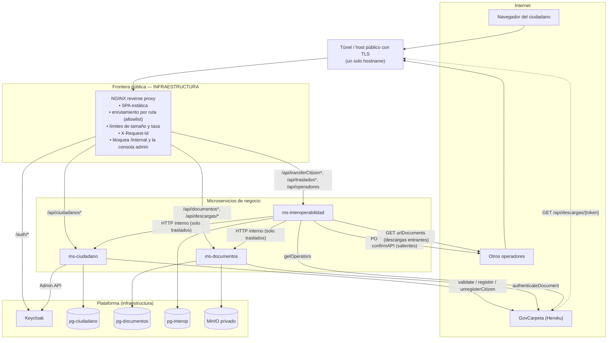
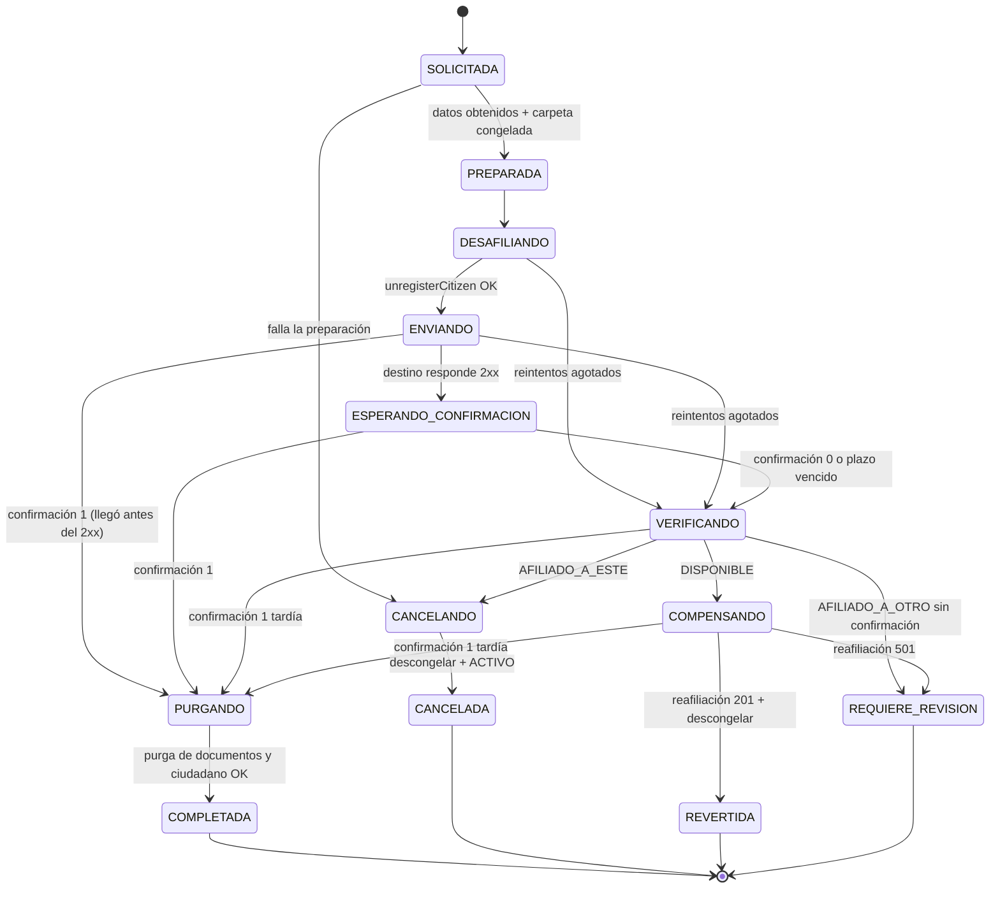
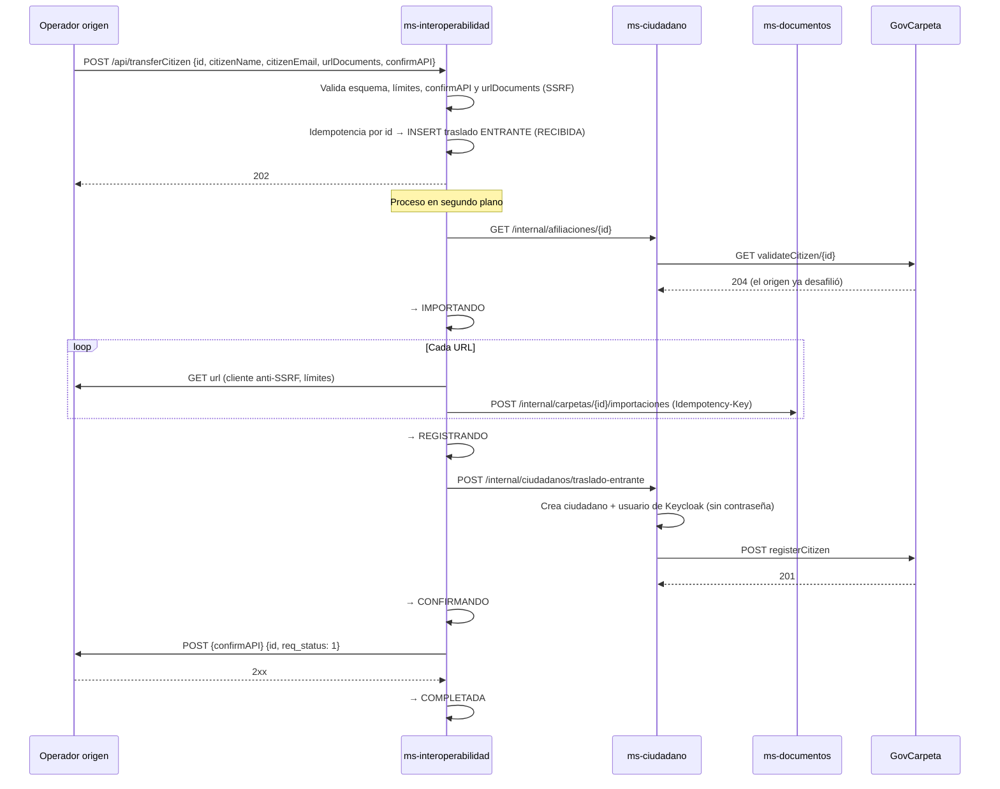

# Arquitectura propuesta — Operador de Carpeta Ciudadana

> **Versión:** 2.0 (revisión arquitectónica definitiva). Reemplaza la versión 1.0 del mismo archivo.
> **Estado:** PROPUESTA PARA APROBACIÓN DEL EQUIPO. No implementada.
> **Fecha:** 2026-09-25
> **Alcance:** los cuatro casos de uso de `05` **más TransferCitizen (entrante y saliente)**, obligatorio para la entrega final.

---

## 0. Convenciones, fuentes y control de cambios

### 0.1 Etiquetas de trazabilidad

| Etiqueta | Significado |
|---|---|
| **[REQ-05]** | Requisito explícito del profesor (`05`). Nivel 1. |
| **[CASO-01]** | Caso de estudio oficial (`01`). Nivel 2. |
| **[ACUERDO-04]** | Contrato de interoperabilidad entre operadores (`04`). Nivel 3. |
| **[SWAGGER]** | Contrato publicado de la API de GovCarpeta, que es un servicio del profesor. Lo cita `02` §1.4. **(verificado)** = comprobado con un GET real durante la auditoría. |
| **[PREVIA-02]** / **[PREVIA-03 AD-xx]** | Decisión o requisito documentado por el equipo en entregas anteriores. Nivel 4. **No es requisito del profesor.** |
| **[EQUIPO]** | Contexto o decisión comunicada por el equipo durante este desarrollo, sin documento en `resources/`. |
| **[PROPUESTA]** | Decisión arquitectónica nueva de este documento. Nivel 5. |
| **[INFERENCIA]** | Conclusión deducida de las fuentes, sin afirmación explícita en ellas. |
| **[INCERTIDUMBRE]** | Hecho desconocido que condiciona el diseño. |
| **PENDIENTE DE CONFIRMACIÓN DEL PROFESOR** | Decisión bloqueada por una respuesta del profesor. |
| **PENDIENTE DE TECHNICAL SPIKE** | Decisión que se resuelve con una prueba técnica (§23). |

Las decisiones se numeran **DA-xx** (Decisión Arquitectónica) y se consolidan en §22.

### 0.2 Fuentes

| Fuente | Nivel | Observación relevante |
|---|---|---|
| `05` Enunciado | 1 | Pide registro, login, carga y autenticación de documentos vía GovCarpeta. **No menciona TransferCitizen, microservicios ni tecnologías.** |
| `01` Caso de estudio | 2 | Afiliación única, correo inmutable, documentos en el operador, transferencia directa entre operadores sin pasar por el centralizador, seguridad sólida. |
| `04` TransferCitizen | 3 | Define `transferCitizen` / `transferCitizenConfirm`. **Autoría ambigua:** el encabezado lo atribuye al profesor, pero el texto lo escribe un compañero ("el profe dejó en el enlace… Me cuentan si están de acuerdo"). `03` §6.1 lo llama "acuerdo entre los equipos". |
| `02` Especificación de requisitos (entrega 1) | 4 | 44 RF y 25 RNF; lista las 7 operaciones de GovCarpeta. |
| `03` Arquitectura (entrega 2) | 4 | 6 microservicios + Keycloak, AD-01 a AD-08, contrato entre operadores y brechas B-01 a B-06. |
| Swagger de GovCarpeta + directorio real | Contrato externo | Verificado con GET: `validateCitizen` 200 = afiliado (texto con el nombre del operador), 204 = libre; `getOperators` devuelve `_id`, `operatorName`, `transferAPIURL`, `participants`. |

**[EQUIPO] TransferCitizen es obligatorio para la entrega final.** `05` no lo menciona. Este documento lo trata como requisito porque así lo confirmó el equipo, y deja constancia de que esa confirmación **no está en `resources/`**.

**[EQUIPO] El profesor valora la arquitectura de microservicios y puede probarla apagando servicios.** Tampoco está en `resources/`. Se adopta como criterio de diseño.

### 0.3 Control de cambios respecto a la versión 1.0

| Tema | v1.0 | v2.0 | Motivo |
|---|---|---|---|
| TransferCitizen | Condicional / segunda fase | **Obligatorio: entrante y saliente** | [EQUIPO] |
| Quién llama a GovCarpeta | Solo `ms-interoperabilidad` (capa anticorrupción centralizada) | **Cada endpoint de GovCarpeta tiene como dueño al servicio de su dominio** (DA-06) | Con TransferCitizen, centralizar GovCarpeta en `interop` crea dependencias cíclicas (§9, §21.1) |
| Autenticación de documentos | `ms-documentos → ms-interoperabilidad → GovCarpeta` | **`ms-documentos → GovCarpeta`**, con un adaptador interno (DA-12) | Elimina un salto y una dependencia sin perder cohesión (§21.2) |
| BD de `ms-interoperabilidad` | Sin BD | **Con BD propia** (DA-09) | La máquina de estados de la transferencia es un estado de negocio real |
| Acceso externo a documentos | URL presignada de MinIO, exponiendo MinIO por un túnel | **URL de capacidad servida por `ms-documentos` a través de la frontera pública**; MinIO nunca se expone (DA-14) | Una sola frontera pública, sin dependencia del host en la firma, revocable y auditable (§15) |
| Comunicación | Solo HTTP síncrono | **Híbrido:** HTTP síncrono para lo interactivo + máquina de estados persistente con procesos en segundo plano para TransferCitizen, **sin broker** (DA-17) | La confirmación es por callback y la transferencia debe sobrevivir a reinicios |
| APIs internas | Protegidas solo por la red | Red + **token de servicio** (DA-21) | Existen operaciones internas destructivas (purga) |
| Frontend | 5 vistas | + **Trasladar mi carpeta** y **estado del traslado** | TransferCitizen es obligatorio |

---

## 1. Resumen ejecutivo

- **Microservicios de negocio: tres.**
  - **`ms-ciudadano`**: titular y afiliación.
  - **`ms-documentos`**: documentos y su certificación.
  - **`ms-interoperabilidad`**: protocolo entre operadores (TransferCitizen) y directorio de operadores.
- **No hay microservicio gateway.** La frontera pública es **infraestructura**: un reverse proxy **NGINX** que enruta por ruta, limita tamaño y tasa y bloquea todo lo no publicado. No valida JWT ni contiene lógica de negocio.
- **Identidad:** Keycloak emite JWT. Cada microservicio los **valida de forma independiente** con las llaves públicas en caché. El ciudadano se identifica en todo el sistema con el claim **`citizen_id`**, que es su número de documento.
- **GovCarpeta:** cada operación la llama **el servicio dueño de ese dominio**.
  - `ms-ciudadano`: `validateCitizen`, `registerCitizen`, `unregisterCitizen`.
  - `ms-documentos`: `authenticateDocument`.
  - `ms-interoperabilidad`: `getOperators`.
  - `registerOperator` y `registerTransferEndPoint` son procedimientos operativos, no funciones de la aplicación.
- **Dependencias internas: solo dos, y ambas existen únicamente para TransferCitizen.** `ms-interoperabilidad → ms-ciudadano` y `ms-interoperabilidad → ms-documentos`. `ms-ciudadano` y `ms-documentos` no llaman a ningún otro microservicio. El grafo es acíclico.
- **Aislamiento:** apagar `ms-interoperabilidad` solo detiene los traslados; registro, login, documentos y autenticación siguen funcionando. Apagar `ms-ciudadano` detiene el registro y el perfil; el login y los documentos siguen. Apagar `ms-documentos` detiene los documentos; registro y login siguen.
- **TransferCitizen:**
  - Se conserva el contrato de `04` sin romperlo.
  - Se implementa como **dos máquinas de estado persistentes** (saliente y entrante) en `interop_db`, con idempotencia por ciudadano, reintentos con retroceso y un único punto de decisión ante fallos.
  - La purga del origen ocurre **solo** tras una confirmación válida.
  - La confirmación se protege con un **token de capacidad dentro de `confirmAPI`**, compatible con el contrato.
- **Documentos para terceros:** URL de capacidad `https://<host-público>/api/descargas/{token}`, de un solo documento, con vigencia corta, revocable y registrada. MinIO es privado y nunca se expone.
- **Infraestructura:** Docker Compose, NGINX, Keycloak, PostgreSQL por servicio, MinIO y un túnel o host público. Se descartan en esta entrega Kubernetes, Kong, RabbitMQ, Vault y la pila completa de observabilidad. Cada descarte está justificado en §19.
- **Antes de implementar** hay que ejecutar 9 technical spikes (§23) y resolver 5 preguntas al profesor (§22.3).

---

## 2. Requisitos confirmados

### 2.1 Requisitos del profesor [REQ-05]

| ID | Requisito |
|---|---|
| R-01 | Registro de un ciudadano en la Carpeta Ciudadana |
| R-02 | Autenticación del ciudadano en el operador (login) |
| R-03 | Cargar documentos en la Carpeta Ciudadana |
| R-04 | Autenticar documentos a través de GovCarpeta |

### 2.2 Requisitos del caso de estudio [CASO-01]

| ID | Requisito | Impacto |
|---|---|---|
| C-01 | Un ciudadano solo puede estar registrado ante un operador a la vez | `validateCitizen` antes de registrar; `unregisterCitizen` antes de trasladar |
| C-02 | El correo generado no puede cambiarse después del primer registro | Correo inmutable; se conserva en los traslados |
| C-03 | El operador consulta la Registraduría | Adaptador simulado (no existe una API real) |
| C-04 | El operador informa a MinTIC que el ciudadano es su cliente | `registerCitizen` |
| C-05 | El ciudadano puede solicitar la transferencia a otro operador | TransferCitizen |
| C-06 | La transferencia de documentos es directa, sin pasar por el centralizador | Los documentos viajan por URLs de operador a operador |
| C-07 | Documentos confidenciales; autorización para evitar accesos indebidos; autenticación sólida | Propiedad por token; URLs de capacidad; Keycloak |
| C-08 | El centralizador maneja la mínima información | GovCarpeta solo recibe identificadores y URLs |

### 2.3 Contratos de interoperabilidad

- **[ACUERDO-04] TransferCitizen:**
  - `POST {transferAPIURL del destino}` con cuerpo `{id, citizenName, citizenEmail, urlDocuments, confirmAPI}`.
  - `POST {confirmAPI}` con cuerpo `{id, req_status}`: 1 = éxito, 0 = fracaso.
  - Secuencia: el origen desafilia en GovCarpeta → envía al destino → espera → borra BD y bucket solo cuando el destino confirma.
- **[SWAGGER] GovCarpeta:** `registerOperator`, `registerTransferEndPoint` (con `endPoint` y `endPointConfirm`), `getOperators`, `validateCitizen`, `registerCitizen`, `unregisterCitizen` y `authenticateDocument`. Detalle en §11.

### 2.4 Contexto y expectativas del equipo [EQUIPO]

- TransferCitizen es obligatorio para la entrega final.
- El profesor puede evaluar el sistema apagando microservicios.
- Hipótesis inicial de tres microservicios. Aquí se evalúa, no se asume (§5 y §21).
- Arquitectura pequeña, coherente y demostrable, sin sobreingeniería.

---

## 3. Decisiones heredadas de la arquitectura anterior

| Decisión previa | Fuente | Resultado | Justificación |
|---|---|---|---|
| Descomposición por capacidad de negocio, no por capa técnica | PREVIA-03 §2.1 | **Se conserva** | Es el criterio que guía §5. Por este mismo criterio se descarta un servicio que agrupe "todas las llamadas externas" |
| Una BD por servicio; ningún servicio consulta la base de otro | PREVIA-03 §2.2 / AD-05 | **Se conserva y se refuerza** con aislamiento de red (§12) | — |
| Seis microservicios | PREVIA-03 AD-01 | **Se modifica → tres** | Solicitudes, premium y notificaciones no aportan a R-01 a R-04 ni a TransferCitizen |
| `ms-notificaciones` en el alcance de la entrega 2 | PREVIA-03 §4.2 | **Se descarta en esta entrega** | Ningún requisito actual exige notificaciones |
| Java 21 + Quarkus 3 | PREVIA-03 AD-04 | **Se conserva** | Formación del equipo; `quarkus-oidc`, tolerancia a fallos, health y scheduler estándar |
| React 18 + TypeScript | PREVIA-03 | **Se conserva** | — |
| Keycloak (OIDC + PKCE) | PREVIA-03 AD-07 | **Se conserva sin MFA** | MFA no es requisito de `05` |
| Validar el JWT en el gateway (Kong) | PREVIA-03 AD-07 | **Se modifica → validación en cada servicio** | Independencia y defensa en profundidad; sin Kong |
| Kong | PREVIA-03 | **Se descarta → NGINX** | §21.3 |
| PostgreSQL | PREVIA-03 AD-05 | **Se conserva** (un contenedor por servicio) | — |
| MinIO/S3 con URLs firmadas | PREVIA-03 AD-05 | **Se modifica** | MinIO se conserva privado; el acceso externo usa URLs de capacidad de `ms-documentos` (§15) |
| "El archivo nunca atraviesa un microservicio" | PREVIA-03 AD-05 | **Se modifica** | La carga y las descargas pasan por `ms-documentos` (§14) |
| RabbitMQ y CU-04 asíncrono | PREVIA-03 AD-06 | **Se modifica** | Híbrido sin broker (§21.4) |
| `ms-interoperabilidad` como capa anticorrupción de GovCarpeta y dueño de la saga | PREVIA-03 §2.2 | **Se modifica** | Conserva la saga y el protocolo entre operadores; las operaciones de GovCarpeta pasan a sus dominios (§21.1) |
| Saga con compensación, temporizador e idempotencia | PREVIA-03 AD-08 | **Se conserva y se detalla** (§10) | — |
| Compensación: "volver a registrar al ciudadano en A" | PREVIA-03 CU-09 | **Se modifica** | Antes de compensar se consulta la afiliación; la compensación es imposible si el destino ya registró al ciudadano (§10.5) |
| En la saga de `03`, `interop` emite URLs y borra objetos de MinIO directamente | PREVIA-03 figura 7 | **Se descarta** | Viola la propiedad de datos: el almacenamiento es de `ms-documentos` |
| `unregisterCitizen` "al confirmar la recepción" | PREVIA-02 §6.4 | **Se descarta** | [ACUERDO-04] y el 501 de `registerCitizen` obligan a desafiliar **antes** de enviar |
| Interpretación "501 de `authenticateDocument` = no certificado" | PREVIA-03 CU-04 | **Se descarta** | [SWAGGER]: 501 = "Wrong Parameters" |
| Kubernetes, Vault, OTel/Prometheus/Grafana/Jaeger/Loki, CDN/WAF, BFF | PREVIA-03 | **Se descartan en esta entrega** | §19 |
| Registro sin dirección | PREVIA-02 RF-01, PREVIA-03 CU-01 | **Se corrige** | [SWAGGER]: `registerCitizen` exige `address` |

---

## 4. Arquitectura propuesta



Las llamadas salientes hacia Internet (GovCarpeta y otros operadores) **no pasan por NGINX**: salen directamente desde el microservicio dueño. Sin embargo, todas las **entradas** desde Internet pasan por NGINX.

---

## 5. Microservicios

### 5.1 ms-ciudadano

| Aspecto | Definición |
|---|---|
| **Responsabilidad** | Titular del operador y su **afiliación**: registro, validación de identidad (Registraduría simulada), unicidad y cambios de afiliación en GovCarpeta (`validateCitizen`, `registerCitizen`, `unregisterCitizen`), correo institucional inmutable, ciclo de vida del usuario en Keycloak (crear, habilitar, eliminar), estados del ciudadano (`PENDIENTE`, `ACTIVO`, `EN_TRASLADO`), alta de ciudadanos que llegan por traslado |
| **Razón de cambio** | Cambian las reglas de afiliación o de identidad del titular |
| **Datos** | `ciudadano_db`: ciudadano (§12) |
| **APIs** | Para el ciudadano: registro y perfil (§8.1). Internas, solo para `interop`: datos para traslado, inicio de traslado, desafiliación, reafiliación, purga, consulta de afiliación, alta por traslado (§8.2) |
| **Depende de** | Su BD, Keycloak (Admin API y JWKS), GovCarpeta. **No depende de ningún otro microservicio** |
| **NO debe** | Conocer documentos; almacenar contraseñas; llamar a otros operadores; decidir cuándo se purga un traslado (eso lo decide la máquina de estados de `interop`) |

### 5.2 ms-documentos

| Aspecto | Definición |
|---|---|
| **Responsabilidad** | Documentos del titular: carga, metadatos, integridad (SHA-256), propiedad, descarga, **certificación ante GovCarpeta** (`authenticateDocument`), **URLs de capacidad** para terceros, congelamiento de la carpeta durante un traslado, exportación e importación de documentos para traslados, purga |
| **Razón de cambio** | Cambian las reglas sobre documentos, su acceso o su certificación. [PREVIA-03 §2.2] ya asignaba la "certificación" a este servicio |
| **Datos** | `documento_db` (documento, intento de autenticación, enlace temporal, carpeta) + bucket privado en MinIO |
| **APIs** | Para el ciudadano: CRUD de lectura, carga, descarga, autenticación. Públicas: `GET /api/descargas/{token}`. Internas, solo para `interop`: congelar/descongelar, enlaces de traslado, importar, revertir importación, purgar |
| **Depende de** | Su BD, MinIO, GovCarpeta (solo al autenticar), JWKS de Keycloak. **No depende de ningún otro microservicio** |
| **NO debe** | Consultar a `ms-ciudadano` para saber quién es el usuario (lo toma del token); descargar URLs de terceros (eso es de `interop`); hablar con otros operadores |

### 5.3 ms-interoperabilidad

| Aspecto | Definición |
|---|---|
| **Responsabilidad** | **Protocolo entre operadores:** contrato TransferCitizen en ambas direcciones, máquinas de estado de traslado (§10), directorio de operadores (`getOperators` en caché), descarga segura de URLs externas (defensa SSRF, §16), llamadas a `confirmAPI`, traducción entre los DTOs de otros operadores y nuestro dominio |
| **Razón de cambio** | Cambia el acuerdo entre operadores o su directorio |
| **Datos** | `interop_db`: traslado, documento de traslado entrante, caché del directorio (§12) |
| **APIs** | Públicas externas: `POST /api/transferCitizen`, `POST /api/transferCitizenConfirm`. Para el ciudadano: `GET /api/operadores`, `POST /api/traslados`, `GET /api/traslados/actual` |
| **Depende de** | Su BD; `ms-ciudadano` y `ms-documentos` (solo para traslados); GovCarpeta (`getOperators`); otros operadores; Keycloak (token de servicio) |
| **NO debe** | Registrar o desafiliar ciudadanos directamente en GovCarpeta (lo pide a `ms-ciudadano`); leer o escribir MinIO ni las BD ajenas (lo pide a `ms-documentos`); contener reglas de negocio de documentos o de afiliación |

### 5.4 ¿Son correctos estos tres límites? (evaluación)

| Criterio | Resultado |
|---|---|
| **Cohesión** | Cada servicio agrupa lo que cambia por la misma razón: afiliación, documento, protocolo entre operadores. Las operaciones de GovCarpeta se reparten **por dominio**, no por tecnología |
| **Acoplamiento** | Dos dependencias internas, ambas desde `interop` y solo para traslados. No hay ciclos. Ningún servicio conoce la BD ni el almacenamiento de otro |
| **Límites claros** | Cada tabla, bucket y endpoint de GovCarpeta tiene un único dueño (§11.1, §12) |
| **Independencia operacional** | Cada servicio arranca y opera solo con sus dependencias propias; sus health checks no consultan a otros servicios (§18) |
| **Aislamiento** | Cada caída elimina solo sus capacidades (§17) |

**¿Se evaluó un cuarto servicio?** Sí, y se descarta:

- `ms-gateway` / `ms-orchestrator` / `ms-public-api` no tienen responsabilidad de negocio. Su única función (recibir y reenviar) ya la cumple la infraestructura de borde (§21.3).
- Un `ms-traslados` separado de `ms-interoperabilidad` partiría un solo proceso (el traslado) de su contrato externo; las dos partes cambiarían juntas.
- `ms-notificaciones` no es un requisito actual.

**¿Se evaluaron menos servicios?** Un monolito no permite demostrar aislamiento. Fusionar `interop` con `ms-ciudadano` haría que una caída del protocolo con otros operadores tumbara también el registro.

---

## 6. Frontera pública

### 6.1 ¿Quién recibe las peticiones de Internet?

```text
Internet (navegador, otros operadores, GovCarpeta)
   │
   ▼
Túnel / host público con TLS            ← recibe (infraestructura; un solo hostname)
   │
   ▼
NGINX (reverse proxy)                   ← enruta por ruta; bloquea lo no publicado (infraestructura)
   │
   ├── /                         → archivos estáticos de la SPA            (NGINX)
   ├── /auth/realms/carpeta/*    → Keycloak                                 (login OIDC)
   ├── /api/ciudadanos*          → ms-ciudadano                             (dueño)
   ├── /api/documentos*          → ms-documentos                            (dueño)
   ├── /api/descargas/*          → ms-documentos                            (dueño; URLs de capacidad)
   ├── /api/transferCitizen      → ms-interoperabilidad                     (dueño)
   ├── /api/transferCitizenConfirm → ms-interoperabilidad                   (dueño)
   ├── /api/traslados*, /api/operadores → ms-interoperabilidad              (dueño)
   └── cualquier otra ruta (incluye /internal/*, /q/*, /auth/admin/*, realm master) → 404
```

**Regla [PROPUESTA — DA-02]:** NGINX funciona como **allowlist**. Solo existen las rutas de la tabla anterior; todo lo demás devuelve 404. Nunca se publican los puertos de los microservicios, las BD, MinIO ni la consola de administración de Keycloak.

### 6.2 Quién recibe, enruta y procesa cada tipo de petición

| Petición externa | Recibe | Enruta | Dueño y procesa | ¿Necesita otro microservicio? | Por qué |
|---|---|---|---|---|---|
| Ciudadano: registro | Túnel → NGINX | NGINX | ms-ciudadano | No | Afiliación y cuenta son su dominio; GovCarpeta y Keycloak son dependencias de plataforma o externas |
| Ciudadano: login | Túnel → NGINX | NGINX | Keycloak | No | — |
| Ciudadano: documentos y autenticación | Túnel → NGINX | NGINX | ms-documentos | No | La propiedad sale del token; GovCarpeta es externa |
| Ciudadano: iniciar traslado | Túnel → NGINX | NGINX | ms-interoperabilidad | **Sí:** ms-ciudadano y ms-documentos | El traslado cruza ambos dominios por naturaleza |
| Otro operador: `transferCitizen` | Túnel → NGINX | NGINX | ms-interoperabilidad | **Sí, en segundo plano** | Crear el ciudadano e importar sus documentos |
| Otro operador: `transferCitizenConfirm` | Túnel → NGINX | NGINX | ms-interoperabilidad | **Sí, en segundo plano** (purga) | Borrar datos de ambos dominios |
| GovCarpeta u otro operador: descarga de un documento | Túnel → NGINX | NGINX | ms-documentos | No | El token de capacidad se resuelve localmente |

**¿`ms-ciudadano` y `ms-documentos` quedan internos?** Se evaluó la hipótesis "solo `interop` es público" y **se rechaza**:

- El navegador del ciudadano necesita llegar a registro, perfil y documentos. Forzar ese tráfico por `interop` lo convertiría en un proxy de negocio: un SPOF y un acoplamiento innecesario.
- GovCarpeta necesita descargar documentos, y la URL de capacidad la resuelve de forma natural el dueño del documento.

Lo que sí se cumple es que **ningún microservicio es alcanzable directamente**: todos quedan detrás de la frontera, y **sus endpoints `/internal/*` jamás se publican**.

---

## 7. APIs externas

"Externa" significa que la consume un sistema fuera de nuestro operador. Todas pasan por NGINX.

| API | Consumidor | Dueño | Pública | Autenticación | Propósito |
|---|---|---|---|---|---|
| `POST /api/transferCitizen` | Otros operadores | ms-interoperabilidad | Sí | **Ninguna, según el contrato [ACUERDO-04].** Controles compensatorios: validación estricta, verificación de afiliación en GovCarpeta, SSRF, límites, rate limit (§10.8) | Recibir un ciudadano trasladado |
| `POST /api/transferCitizenConfirm` | Otros operadores | ms-interoperabilidad | Sí | **Token de capacidad en el query de `confirmAPI`** (`?t=…`) + validación contra el estado local (§10.8) | Recibir el resultado de nuestro traslado saliente |
| `GET` y `HEAD /api/descargas/{token}` | GovCarpeta (`authenticateDocument`), otros operadores (traslado) | ms-documentos | Sí | **Token de capacidad**: opaco, 256 bits, un documento, vigencia corta, revocable (§15) | Entregar un documento a un tercero autorizado |
| `/auth/realms/carpeta/*` (páginas OIDC, token, JWKS) | Navegador | Keycloak | Sí | OIDC Authorization Code + PKCE | Login |

## 8. APIs internas

### 8.1 Consumidas por el frontend (pasan por NGINX con JWT del ciudadano)

| API | Dueño | Autenticación / autorización | Propósito | Respuesta resumida | Códigos |
|---|---|---|---|---|---|
| `POST /api/ciudadanos` | ms-ciudadano | Pública (sin token), con rate limit | Registro | `{id, emailInstitucional, estado}` | 201, 400, 409 (`YA_REGISTRADO_AQUI` \| `AFILIADO_OTRO_OPERADOR`), 422, 503 |
| `GET /api/ciudadanos/me` | ms-ciudadano | JWT; `citizen_id` | Perfil | `{id, nombres, apellidos, direccion, emailInstitucional, estado}` | 200, 401, 404 |
| `POST /api/documentos` | ms-documentos | JWT; propietario = `citizen_id` | Cargar (multipart) | `{id, titulo, estado: CARGADO, sha256, …}` | 201, 400, 401, 409 (`CARPETA_CONGELADA`), 413, 415, 503 |
| `GET /api/documentos` | ms-documentos | JWT | Listar los propios | `[{id, titulo, estado, …}]` | 200, 401 |
| `GET /api/documentos/{id}` | ms-documentos | JWT; debe ser del propietario | Detalle + intentos | `{…, intentos[]}` | 200, 401, 404 |
| `GET /api/documentos/{id}/contenido` | ms-documentos | JWT; debe ser del propietario | Descargar | binario (`attachment`) | 200, 401, 404, 503 |
| `POST /api/documentos/{id}/autenticacion` | ms-documentos | JWT; debe ser del propietario | Autenticar ante GovCarpeta | `{estado, mensaje, fecha}` | 200, 401, 404, 409, 502, 503 |
| `GET /api/operadores` | ms-interoperabilidad | JWT | Operadores de destino válidos (con `transferAPIURL`, excluyéndonos) | `[{operadorId, nombre}]` | 200, 401, 503 |
| `POST /api/traslados` | ms-interoperabilidad | JWT; titular = `citizen_id` | Iniciar traslado saliente | `{transferId, estado}` | 202, 400, 401, 409 (`TRASLADO_EN_CURSO`), 503 |
| `GET /api/traslados/actual` | ms-interoperabilidad | JWT | Estado del traslado del titular | `{transferId, estado, destino, actualizadoEn}` | 200, 401, 404 |

### 8.2 Consumidas solo por otros microservicios (`/internal/*`, jamás publicadas)

**Autenticación [PROPUESTA — DA-21]:** además del aislamiento de red, se exige un **token de servicio** de Keycloak (client credentials del cliente `ms-interoperabilidad` con el rol `interop-interno`). La razón es que existen operaciones destructivas: purga de un ciudadano y de su carpeta.

**Todas estas APIs son idempotentes.**

| API | Dueño | Consumidor | Propósito | Request → Response | Códigos |
|---|---|---|---|---|---|
| `GET /internal/afiliaciones/{id}` | ms-ciudadano | interop | Afiliación según GovCarpeta, traducida | → `{estado: DISPONIBLE \| AFILIADO_A_ESTE \| AFILIADO_A_OTRO, operador?}` | 200, 502, 504 |
| `POST /internal/ciudadanos/{id}/traslado-saliente` | ms-ciudadano | interop | Marcar `EN_TRASLADO` y devolver los datos para el contrato | `{transferId}` → `{id, nombreCompleto, emailInstitucional, direccion}` | 200, 404, 409 |
| `POST /internal/ciudadanos/{id}/desafiliacion` | ms-ciudadano | interop | `unregisterCitizen` | `{transferId}` → `{resultado}` | 200, 502, 504 |
| `POST /internal/ciudadanos/{id}/reafiliacion` | ms-ciudadano | interop | Compensación: `registerCitizen` + `ACTIVO` | `{transferId}` → `{resultado: REAFILIADO \| AFILIADO_A_OTRO}` | 200, 409, 502, 504 |
| `DELETE /internal/ciudadanos/{id}` | ms-ciudadano | interop | Purga: usuario de Keycloak + registro | → vacío | 204 (también si ya no existe) |
| `POST /internal/ciudadanos/traslado-entrante` | ms-ciudadano | interop | Crear el ciudadano recibido, su usuario de Keycloak y `registerCitizen` | `{transferId, id, nombreCompleto, email, direccion?}` → `{estado}` | 201, 200 (repetido), 409 (`AFILIADO_A_OTRO` / `YA_EXISTE`), 502, 504 |
| `PUT` / `DELETE /internal/carpetas/{propietarioId}/congelamiento` | ms-documentos | interop | Congelar o descongelar la carpeta (bloquea cargas y autenticaciones) | `{transferId}` → vacío | 204 |
| `POST /internal/carpetas/{propietarioId}/enlaces-traslado` | ms-documentos | interop | Emitir URLs de capacidad de **todos** los documentos | `{transferId, ttl}` → `[{titulo, url}]` | 200, 404 |
| `POST /internal/carpetas/{propietarioId}/importaciones` | ms-documentos | interop | Guardar un documento recibido (flujo binario + metadatos). `Idempotency-Key: {transferId}:{índice}` | → `{documentoId}` | 201, 200 (repetido), 413, 503 |
| `DELETE /internal/carpetas/{propietarioId}/importaciones/{transferId}` | ms-documentos | interop | Revertir una importación fallida | → vacío | 204 |
| `DELETE /internal/carpetas/{propietarioId}` | ms-documentos | interop | Purga: objetos + metadatos + enlaces | → vacío | 204 (también si ya no existe) |

**Operaciones sin API** (procedimientos operativos con script documentado): `registerOperator`, `registerTransferEndPoint` y la limpieza de ciudadanos de prueba (`unregisterCitizen`) (§11.2).

### 8.3 URLs temporales

| Tipo | Emisor | Vigencia | Uso |
|---|---|---|---|
| URL de capacidad para autenticación | ms-documentos | 15 min | `UrlDocument` en `authenticateDocument` |
| URL de capacidad para traslado | ms-documentos | 60 min; se regenera en cada reintento de envío | Valores de `urlDocuments` |
| `confirmAPI` con token | ms-interoperabilidad | Hasta el cierre del traslado | Confirmación de nuestro traslado saliente |

---

## 9. Matriz de dependencias

### 9.1 Entre microservicios (las seis combinaciones posibles)

| Origen → Destino | ¿Existe? | Motivo / datos | Quién inicia | Si el destino está caído | ¿Evitable? | ¿Evitarla empeora la arquitectura? |
|---|---|---|---|---|---|---|
| ms-ciudadano → ms-documentos | **No** | Ningún flujo del titular necesita documentos | — | — | — | — |
| ms-documentos → ms-ciudadano | **No** | La identidad y la propiedad salen del JWT; que el ciudadano esté activo lo garantiza que el usuario de Keycloak se habilita solo cuando está `ACTIVO` | — | — | Sí, ya se evita | No. Consultar a `ms-ciudadano` en cada request acoplaría la disponibilidad de los documentos a la del registro |
| ms-ciudadano → ms-interoperabilidad | **No** | El registro llama directamente a GovCarpeta (DA-06) | — | — | Sí | No; esta dependencia además cerraba un ciclo con la siguiente |
| **ms-interoperabilidad → ms-ciudadano** | **Sí** | Traslados: datos del titular, `EN_TRASLADO`, desafiliar, reafiliar, purgar, consultar afiliación, alta por traslado | interop (procesos en segundo plano o petición del ciudadano) | Iniciar un traslado → 503. Los traslados en curso **esperan y reintentan**; nada se pierde porque el estado está en `interop_db` | No | Sí: la alternativa sería que `interop` escribiera la BD o llamara a GovCarpeta por cuenta de `ciudadano`, violando la propiedad de datos |
| ms-documentos → ms-interoperabilidad | **No** | La autenticación llama directamente a GovCarpeta (DA-12) | — | — | Sí | No (§21.2) |
| **ms-interoperabilidad → ms-documentos** | **Sí** | Traslados: congelar, enlaces, importar, revertir, purgar | interop | Igual que la fila de `ms-ciudadano` | No | Sí: la alternativa sería que `interop` accediera a MinIO, como en la figura 7 de `03` |

**Resultado:** el grafo es acíclico. Solo hay un nodo con dependencias salientes internas (`interop`) y **solo para TransferCitizen**, que por definición cruza ambos dominios.

### 9.2 Matriz completa (incluye plataforma y dependencias externas)

| Origen | Destino | Motivo | Obligatoria | Alternativa | Riesgo |
|---|---|---|---|---|---|
| ms-ciudadano | GovCarpeta | `validate` / `register` / `unregisterCitizen` | Sí (C-01, C-04) | Ninguna | Heroku caído o lento; entorno compartido |
| ms-ciudadano | Keycloak Admin | Crear, habilitar y eliminar usuario | Sí | Autenticación propia (descartada, §13) | Keycloak caído → no hay registro ni alta por traslado |
| ms-ciudadano | pg-ciudadano | Persistencia | Sí | — | Afecta solo a este servicio |
| ms-documentos | GovCarpeta | `authenticateDocument` | Sí (R-04) | Pasar por `interop` (descartado) | GovCarpeta caído → no hay autenticación |
| ms-documentos | MinIO | Binarios | Sí | Volumen de disco (viable, menos portable) | Afecta a carga, descarga y enlaces |
| ms-documentos | pg-documentos | Persistencia | Sí | — | Afecta solo a este servicio |
| ms-interoperabilidad | ms-ciudadano / ms-documentos | Traslados | Sí | — | Traslados en pausa; se reanudan |
| ms-interoperabilidad | GovCarpeta | `getOperators` | Sí | Directorio configurado a mano (respaldo) | Caché con fecha de vigencia |
| ms-interoperabilidad | Otros operadores | `transferCitizen`, `confirmAPI`, descargas | Sí | — | Operadores caídos o no conformes; SSRF |
| ms-interoperabilidad | pg-interop | Estados del traslado | Sí | — | Sin BD no se aceptan traslados (503) |
| Los tres servicios | Keycloak (JWKS) | Validar JWT | Sí | — | Llaves en caché: tolera caídas breves |
| NGINX | Todos | Enrutamiento | Sí | — | SPOF de entrada aceptado (§17.3) |

---

## 10. TransferCitizen

### 10.1 Principios [PROPUESTA — DA-15, DA-16]

1. **Compatibilidad:** se envía y se acepta **exactamente** el contrato de `04`. Cualquier extensión es opcional y tolerante (§10.9).
2. **Estado persistente antes de actuar:** cada paso se registra en `interop_db` **antes** de la llamada externa. Por eso una confirmación nunca llega sin estado previo, y un reinicio retoma el trabajo desde donde quedó.
3. **Idempotencia por ciudadano:** a lo sumo **un traslado activo por ciudadano y por dirección**, garantizado por una restricción única en la BD. Internamente se genera un `transferId` (UUID) para correlación y trazabilidad.
4. **Un único punto de decisión ante la incertidumbre:** el estado `VERIFICANDO` consulta la afiliación real en GovCarpeta antes de compensar o purgar.
5. **Nunca se purga sin una confirmación válida** (`req_status = 1` que corresponda a un traslado activo).
6. **Trabajo en segundo plano sin broker:** un proceso programado en `ms-interoperabilidad` reclama traslados pendientes (`proximo_intento_en <= ahora`) con bloqueo de fila y ejecuta el siguiente paso.

### 10.2 Traslado saliente (somos el origen A)

**Quién inicia:** el ciudadano, desde la UI → `POST /api/traslados {operadorDestinoId}` → `ms-interoperabilidad`.
**Quién guarda el estado y espera la confirmación:** `ms-interoperabilidad` (`interop_db`).
**Cuándo se eliminan datos:** solo en el estado `PURGANDO`, alcanzado únicamente por una confirmación `req_status = 1` válida.

```mermaid
sequenceDiagram
    actor U as Ciudadano
    participant I as ms-interoperabilidad
    participant C as ms-ciudadano
    participant D as ms-documentos
    participant G as GovCarpeta
    participant B as Operador destino

    U->>I: POST /api/traslados {operadorDestinoId} (JWT)
    I->>I: Valida: sin traslado activo; destino en el directorio con transferAPIURL
    I->>I: INSERT traslado SALIENTE (SOLICITADA)
    I-->>U: 202 {transferId, estado}
    Note over I: Proceso en segundo plano
    I->>C: POST /internal/ciudadanos/{id}/traslado-saliente
    C-->>I: datos (nombre, correo, dirección)
    I->>D: PUT /internal/carpetas/{id}/congelamiento
    I->>I: PREPARADA → DESAFILIANDO
    I->>C: POST /internal/ciudadanos/{id}/desafiliacion
    C->>G: DELETE /apis/unregisterCitizen
    G-->>C: 201/204
    I->>I: → ENVIANDO (persistido ANTES del POST)
    I->>D: POST /internal/carpetas/{id}/enlaces-traslado (TTL 60 min)
    I->>B: POST {transferAPIURL} {id, citizenName, citizenEmail, urlDocuments, confirmAPI=.../api/transferCitizenConfirm?t=TOKEN}
    B-->>I: 2xx
    I->>I: → ESPERANDO_CONFIRMACION (con plazo)
    B->>G: registerCitizen (lado de B)
    B->>I: POST /api/transferCitizenConfirm?t=TOKEN {id, req_status: 1}
    I->>I: Valida token + estado → PURGANDO
    I-->>B: 200
    I->>D: DELETE /internal/carpetas/{id}
    I->>C: DELETE /internal/ciudadanos/{id}
    I->>I: → COMPLETADA
```

**Qué implica que el ciudadano esté `EN_TRASLADO`:** puede seguir iniciando sesión y **consultar** sus documentos. La carga y la autenticación se rechazan con 409 `CARPETA_CONGELADA`, porque cualquier cambio posterior a la emisión de los enlaces se perdería. Su usuario de Keycloak se elimina en la purga.

### 10.3 Máquina de estados saliente



| Estado | Significado | Qué lo resuelve |
|---|---|---|
| `SOLICITADA` | Registrado; todavía no se ha tocado nada | Proceso en segundo plano |
| `PREPARADA` | Ciudadano `EN_TRASLADO` y carpeta congelada | Proceso en segundo plano |
| `DESAFILIANDO` | Llamando a `unregisterCitizen` (reintentable: 201/204 son OK) | Proceso en segundo plano |
| `ENVIANDO` | Enviando `transferCitizen` con reintentos. **Ya se acepta la confirmación** | Proceso / confirmación |
| `ESPERANDO_CONFIRMACION` | El destino aceptó; hay un plazo en curso | Confirmación / plazo |
| `VERIFICANDO` | **Punto único de decisión:** consulta `GET /internal/afiliaciones/{id}` | Proceso en segundo plano |
| `COMPENSANDO` | Reafiliándonos (`registerCitizen`) | Proceso en segundo plano |
| `CANCELANDO` | Deshaciendo la preparación: GovCarpeta nunca cambió | Proceso en segundo plano |
| `PURGANDO` | Confirmación válida recibida; borrando (idempotente, se reintenta hasta lograrlo) | Proceso en segundo plano |
| `COMPLETADA` | Final: los datos ya no están en nuestro operador | — |
| `CANCELADA` / `REVERTIDA` | Final: el ciudadano sigue siendo nuestro y está `ACTIVO` | — |
| `REQUIERE_REVISION` | Final: GovCarpeta muestra al ciudadano en otro operador sin una confirmación válida. **No se purga.** Se resuelve manualmente con un procedimiento documentado | Operador humano |

**Regla contra la eliminación prematura:** la única transición hacia `PURGANDO` es una confirmación `req_status = 1` que cumpla §10.8. Ni el vencimiento del plazo ni la consulta a GovCarpeta llevan a `PURGANDO`.

**Decisión conservadora ante una confirmación perdida [PROPUESTA — DA-18]:** si el plazo vence y GovCarpeta muestra al ciudadano afiliado **al mismo destino al que lo enviamos**, lo más probable es que el traslado haya sido exitoso y la confirmación se haya perdido. Aun así se va a `REQUIERE_REVISION`, no a la purga, porque [ACUERDO-04] exige confirmación para borrar. La alternativa de "confirmación inferida" queda como **PENDIENTE DE CONFIRMACIÓN DEL PROFESOR** (pregunta 1).

### 10.4 Traslado entrante (somos el destino B)

**Endpoint receptor:** `POST /api/transferCitizen` → NGINX → `ms-interoperabilidad`.
**Respuesta:** **202 Accepted** inmediato, tras validar y persistir. El procesamiento es asíncrono y termina con la llamada a `confirmAPI`, que es lo que describe [ACUERDO-04] ("habrá un paso en el cual se deberá hacer el llamado a la API de confirmación").

**Orden de pasos [PROPUESTA — DA-19]:** documentos primero, **registro en GovCarpeta al final**. `registerCitizen` es el **punto de compromiso**: antes de él todo se puede revertir y podemos responder `req_status = 0` sin haber tocado GovCarpeta. Eso permite al origen compensar reafiliándose. Si registráramos primero y luego fallara la importación, el origen no podría reafiliarse (recibiría un 501).



### 10.5 Máquina de estados entrante

| Estado | Acción | Éxito → | Fallo → |
|---|---|---|---|
| `RECIBIDA` | Verificar afiliación | `DISPONIBLE` → `IMPORTANDO` | `AFILIADO_A_OTRO`: se reintenta durante 5 min (el origen puede tardar en desafiliar) y luego `REVIRTIENDO`. `AFILIADO_A_ESTE` → `REVIRTIENDO` (conflicto) |
| `IMPORTANDO` | Descargar e importar cada documento (3 intentos por URL) | `REGISTRANDO` | `REVIRTIENDO` |
| `REGISTRANDO` | Alta local + Keycloak + `registerCitizen` | `CONFIRMANDO` | 501 u otro fallo definitivo → `REVIRTIENDO` (`ms-ciudadano` deshace su propia creación parcial) |
| `CONFIRMANDO` | `POST confirmAPI {req_status:1}` con reintentos | `COMPLETADA` | Reintentos agotados → `COMPLETADA_SIN_CONFIRMAR`: sigue reintentando con baja frecuencia y se reenvía si llega un duplicado |
| `REVIRTIENDO` | Borrar importaciones del `transferId` (y el ciudadano parcial si existiera) | `NOTIFICANDO_FALLO` | Reintentar |
| `NOTIFICANDO_FALLO` | `POST confirmAPI {req_status:0}` con reintentos | `FALLIDA` | Tras agotar reintentos → `FALLIDA` (registrado) |

### 10.6 Idempotencia, duplicados y concurrencia

| Situación | Comportamiento |
|---|---|
| `transferCitizen` duplicado mientras se procesa | 202, sin crear otro traslado (misma fila) |
| `transferCitizen` duplicado después de `COMPLETADA` | 200 y se **reenvía** la confirmación 1. Esto resuelve el caso en que nuestra confirmación anterior se perdió |
| `transferCitizen` después de `FALLIDA` | Se admite como un traslado nuevo (el origen reintentó) |
| `transferCitizen` para un ciudadano que ya es nuestro y está `ACTIVO` (no llegó por traslado) | 409 + confirmación 0 si `confirmAPI` es válido |
| Confirmación duplicada (`req_status = 1`) | 200 sin efecto |
| Confirmación 0 después de 1, o 1 después de `REVERTIDA` | 409; se registra; si hay conflicto real → `REQUIERE_REVISION` |
| Confirmación antes de que termine nuestro POST | Aceptada: el estado `ENVIANDO` se persistió antes del POST |
| Doble clic en "Trasladar" | 409 `TRASLADO_EN_CURSO` (restricción única) |
| Dos procesos compitiendo por el mismo traslado | Bloqueo de fila al reclamarlo + columna de versión optimista |
| Reinicio de `interop` a mitad de un paso | El proceso retoma el estado persistido; todos los pasos son idempotentes |

### 10.7 Tiempos, TTL y reintentos [PROPUESTA — configurables]

| Parámetro | Valor para la demo | Justificación |
|---|---|---|
| Timeout del POST a `transferCitizen` | 30 s | El destino puede procesar de forma síncrona |
| Reintentos de envío | 5, con retroceso de 30 s, 1, 2, 4 y 8 min | Tolera caídas breves del destino |
| Plazo para recibir la confirmación | 30 min (producción: horas) | Brecha B-06 de `03`: no hay un plazo acordado |
| TTL de las URLs de traslado | 60 min; nuevas en cada reintento de envío | Brecha B-05 de `03` |
| Descarga entrante por archivo | Conexión 5 s, total 60 s, 3 intentos | — |
| Reintentos de `confirmAPI` | 10 en aproximadamente 1 h | — |
| Espera a que el origen desafilie | 5 min | Tolera un origen lento |
| Frecuencia del proceso en segundo plano | 10 s | — |

### 10.8 Seguridad del protocolo [PROPUESTA — DA-20]

El contrato de `04` **no tiene autenticación**. No se puede autenticar al emisor sin un acuerdo entre equipos, así que se aplican controles que no rompen compatibilidad:

| Riesgo | Control |
|---|---|
| **Confirmación falsificada que provoca la purga** (el riesgo más grave) | (1) `confirmAPI = https://<host>/api/transferCitizenConfirm?t=<token de 256 bits>`: el token solo lo conoce quien recibió nuestro `transferCitizen`, y se guarda como hash. (2) La confirmación solo tiene efecto si existe un traslado saliente activo para ese `id` en un estado que la admita. (3) Si el cliente del otro equipo descarta el query, se acepta la confirmación sin token **solo** si además GovCarpeta muestra al ciudadano afiliado a otro operador. Esa política de respaldo es **PENDIENTE DE TECHNICAL SPIKE** (SP-06) |
| `transferCitizen` falso (inyección de ciudadanos) | El traslado solo avanza si GovCarpeta muestra al ciudadano **sin operador** (lo que prueba que alguien lo desafilió). Límites de documentos y bytes. Rate limit en NGINX. El usuario se crea **sin contraseña** y solo se activa por el flujo de §13.4 |
| SSRF por `urlDocuments` y `confirmAPI` | §16 |
| Exposición de información | Respuestas externas genéricas, sin trazas ni datos personales. No se registran en logs URLs completas ni tokens (solo un prefijo del hash). En los logs, el número de documento aparece enmascarado |
| Correlación | `transferId` interno + `X-Request-Id` en todos los logs del traslado |

### 10.9 Problemas del contrato y extensiones propuestas

| Problema | Extensión opcional propuesta | ¿Rompe compatibilidad? | ¿Consultar? |
|---|---|---|---|
| No hay identificador de transferencia (B-03) | Campo opcional `transferId` en ambos mensajes, devuelto en la confirmación | No, si los receptores ignoran campos desconocidos | Otros equipos |
| No hay metadatos de los documentos (B-01) | Campo opcional `documents: [{url, title, type, issuedAt, certified}]` además de `urlDocuments` | No | Otros equipos |
| Falta la dirección, que el destino necesita para `registerCitizen` | Campo opcional `citizenAddress` | No | Otros equipos. Mientras tanto se usa un valor provisional (**PENDIENTE DE TECHNICAL SPIKE** SP-07) |
| `req_status = 0` no explica el motivo (B-04) | Campo opcional `message` | No | Otros equipos |
| Sin autenticación | Token en `confirmAPI` (**ya compatible, sin cambiar el contrato**). Un secreto compartido requeriría un acuerdo | Token: no | Profesor (pregunta 1) |
| Formato ambiguo de `urlDocuments` | **Interpretación [INFERENCIA]:** clave = nombre del documento, valor = lista de URLs de ese documento. Al recibir se tolera un string o una lista | — | Otros equipos |
| No se definen códigos de respuesta | Se definen los nuestros (§10.10) | — | — |

**Política de envío [PROPUESTA]:** **recibimos** las extensiones si vienen, pero **no las enviamos** hasta que se acuerden. Un receptor estricto que rechace campos desconocidos podría fallar con ellas.

### 10.10 Códigos de respuesta de nuestros endpoints externos

| Endpoint | Código | Caso |
|---|---|---|
| `transferCitizen` | 202 | Aceptado (nuevo o en curso) |
| | 200 | Ya completado (se reenvía la confirmación 1) |
| | 400 | Cuerpo inválido o URLs rechazadas por la política. Si `confirmAPI` es válido, también se envía confirmación 0 |
| | 409 | El ciudadano ya está activo en nuestro operador (+ confirmación 0) |
| | 413 | Demasiados documentos |
| | 429 | Rate limit (NGINX) |
| | 503 | No podemos persistir (BD caída). El origen debe reintentar |
| `transferCitizenConfirm` | 200 | Procesada o duplicada sin efecto |
| | 400 | Cuerpo inválido (`req_status` distinto de 0 y 1, falta `id`) |
| | 404 | No hay un traslado saliente que admita la confirmación, o el token es inválido. Es la misma respuesta en ambos casos, para no dar pistas |
| | 409 | Contradice un estado final |
| | 503 | BD caída |

### 10.11 Persistencia del traslado

Ver §12 (`interop_db`).

---

## 11. Integración con GovCarpeta

### 11.1 Cada operación de GovCarpeta tiene un único dueño [PROPUESTA — DA-06]

| Operación [SWAGGER] | Dueño | Cuándo | Envía | Respuesta y qué hacemos | Errores importantes |
|---|---|---|---|---|---|
| `POST /apis/registerOperator` | **Procedimiento operativo** (script), una sola vez | Antes de la primera prueba real | `name`, `address`, `contactMail`, `participants[]` | 201 + `operatorId` → se guarda en la configuración (§11.2) | El esquema del Swagger es inconsistente (`nameOperator`/`adress` en `required`) → **PENDIENTE DE TECHNICAL SPIKE** SP-07 |
| `PUT /apis/registerTransferEndPoint` | **Procedimiento operativo**, que se vuelve a ejecutar si cambia el host público | Al publicar el host | `idOperator`, `endPoint = https://<host>/api/transferCitizen`, `endPointConfirm = https://<host>/api/transferCitizenConfirm` | 201 | Si el host cambia (túnel temporal), el directorio queda desactualizado → conviene un host estable (§19) |
| `GET /apis/getOperators` | ms-interoperabilidad | Al listar destinos y al iniciar un traslado (caché de 5 min) | — | Lista con `_id`, `operatorName`, `transferAPIURL` **(verificado)**. Se filtran los que no tienen URL y el propio operador | Difiere del ejemplo del Swagger (`OperatorId`); lectura tolerante |
| `GET /apis/validateCitizen/{id}` | ms-ciudadano | Registro; y a pedido de `interop` en traslados | id | **204 → `DISPONIBLE`**, **200 + texto → `AFILIADO_A_ESTE` / `AFILIADO_A_OTRO`** (comparando con `OPERATOR_NAME`) **(verificado)** | Distinguir por texto libre es frágil → SP-07 |
| `POST /apis/registerCitizen` | ms-ciudadano | Registro, alta por traslado, compensación | `id` (number), `name`, `address`, `email`, `operatorId`, `operatorName` | 201 → registrado. **501 → "ya registrado"** → se vuelve a consultar la afiliación | 500 o timeout: resultado ambiguo → reconciliación (§13.3) |
| `DELETE /apis/unregisterCitizen` | ms-ciudadano | Traslado saliente (desafiliación); limpieza de pruebas | Cuerpo: `id`, `operatorId`, `operatorName` | 201 / 204 → desafiliado | **DELETE con cuerpo:** comprobar que el cliente HTTP lo envía (SP-07) |
| `PUT /apis/authenticateDocument` | ms-documentos | El ciudadano pulsa "Autenticar" | `idCitizen`, `UrlDocument` (URL de capacidad), `documentTitle` | **200 + texto → `AUTENTICADO`**; **204 → `NO_AUTENTICADO`** | **501 = "Wrong Parameters"** (error nuestro; **no** es "no certificado"); 500 o timeout → `ERROR_AUTENTICACION`, reintentable. **[INCERTIDUMBRE]** Si GovCarpeta descarga realmente el documento → SP-01 |

### 11.2 Configuración del operador

| Dato | Origen | Dónde vive | Quién lo usa |
|---|---|---|---|
| `OPERATOR_ID` | Respuesta de `registerOperator` | `.env` (fuera de git) → variable de entorno | ms-ciudadano, ms-interoperabilidad |
| `OPERATOR_NAME` | Decisión del equipo (**PENDIENTE**) | `.env` | ms-ciudadano (`registerCitizen`, interpretar `validateCitizen`), ms-interoperabilidad |
| `PUBLIC_BASE_URL` | Host público elegido (§19) | `.env` | ms-documentos (URLs de capacidad), ms-interoperabilidad (`confirmAPI`), script de `registerTransferEndPoint` |
| `GOVCARPETA_BASE_URL` | Swagger | `.env` | ms-ciudadano, ms-documentos, ms-interoperabilidad |
| Nuestra `transferAPIURL` | `PUBLIC_BASE_URL + /api/transferCitizen` | Se publica con `registerTransferEndPoint` | Otros operadores (vía `getOperators`) |

### 11.3 Capa anticorrupción

- Cada servicio encapsula las operaciones que le pertenecen en un **adaptador interno** (un puerto de dominio más un cliente HTTP con DTOs externos).
- Los DTOs de GovCarpeta y de otros operadores **nunca salen del adaptador**. Hacia el dominio se traducen a tipos propios (`DISPONIBLE`, `AUTENTICADO`, `ENVIANDO`…).
- No hay duplicación: cada endpoint de GovCarpeta lo implementa **un solo** servicio.
- El versionado de contratos externos queda aislado en ese adaptador.

### 11.4 Entorno compartido

GovCarpeta no tiene autenticación y es compartido. Hay 73 operadores registrados, varios de prueba, y los ids de ejemplo ya están afiliados **(verificado)**. Reglas:

- Rango propio de ids ficticios para pruebas (PENDIENTE).
- Limpieza con `unregisterCitizen` tras cada sesión.
- Pruebas automáticas con GovCarpeta **simulado** (WireMock); contra el real, solo pruebas de humo.

---

## 12. Autenticación, autorización y persistencia

### 12.1 Autenticación y autorización por tipo de API

| Tipo | Autenticación | Autorización | Quién la aplica |
|---|---|---|---|
| APIs del ciudadano | JWT de Keycloak (firma, `iss`, `aud=carpeta-api`, `exp`) | Rol `ciudadano`; propiedad por `citizen_id` | Cada microservicio, de forma independiente |
| Registro | Ninguna | Rate limit; reglas de negocio | NGINX + ms-ciudadano |
| APIs `/internal/*` | Token de servicio (client credentials) + red | Rol `interop-interno` | ms-ciudadano, ms-documentos |
| `transferCitizen` | Ninguna (contrato) | Controles compensatorios (§10.8) | ms-interoperabilidad |
| `transferCitizenConfirm` | Token de capacidad en el query | Estado local del traslado | ms-interoperabilidad |
| `/api/descargas/{token}` | Token de capacidad | Documento, propósito y vigencia asociados al token | ms-documentos |

**El backend siempre es la autoridad.** Ninguna decisión de propiedad, autorización, traslado o eliminación depende del frontend.

### 12.2 Persistencia [DA-07, DA-08, DA-09]

**Regla:** un contenedor PostgreSQL **por servicio**, cada uno en una **red Docker privada compartida solo con su servicio**. `ms-documentos` literalmente no puede alcanzar `pg-ciudadano`. Las credenciales son distintas y no hay llaves foráneas entre servicios: los identificadores que cruzan servicios son **valores**.

**`ciudadano_db` (ms-ciudadano)**

| Entidad | Campos principales |
|---|---|
| ciudadano | `id` (número de documento, PK), nombres, apellidos, dirección, email_personal, **email_institucional (UNIQUE, nunca se actualiza)**, keycloak_user_id, estado (`PENDIENTE`, `ACTIVO`, `EN_TRASLADO`), origen (`REGISTRO` \| `TRASLADO_ENTRANTE`), transfer_id_entrada (idempotencia), fechas |

**`documento_db` (ms-documentos)**

| Entidad | Campos principales |
|---|---|
| carpeta | propietario_id (PK), estado (`ACTIVA` \| `CONGELADA`), transfer_id |
| documento | id (uuid), propietario_id, título, tipo, descripción, nombre_archivo, mime, tamaño, sha256, object_key (`docs/{uuid}`), estado (`CARGADO`, `EN_AUTENTICACION`, `AUTENTICADO`, `NO_AUTENTICADO`, `ERROR_AUTENTICACION`, `IMPORTADO`), origen (`CARGA` \| `TRASLADO`), clave_importacion (UNIQUE: `transferId:índice`), fechas |
| intento_autenticacion | id, documento_id, fecha, resultado, código_http, mensaje |
| enlace_temporal | token_hash (PK), documento_id, propósito (`AUTENTICACION` \| `TRASLADO`), expira_en, revocado, accesos, último_acceso |

**`interop_db` (ms-interoperabilidad) — necesaria [DA-09]**

Justificación funcional, no dogmática: sin esta BD **no se puede** cumplir la regla "no borrar antes de confirmar" ante reinicios, ni la idempotencia, ni los reintentos, ni la validación de la confirmación.

| Entidad | Campos principales |
|---|---|
| traslado | transfer_id (uuid, PK), dirección (`SALIENTE` \| `ENTRANTE`), citizen_id, operador_contraparte (id, nombre, url), confirm_token_hash (saliente), confirm_api (entrante, ya validada), estado, intentos, próximo_intento_en, plazo, último_error, request_id, versión, fechas. **UNIQUE parcial:** (citizen_id, dirección) mientras el estado no sea final |
| traslado_documento (entrante) | transfer_id, índice, nombre, url, estado, intentos, documento_id resultante |
| operador_cache | operador_id, nombre, transfer_api_url, obtenido_en |

**Keycloak:** almacén propio con volumen persistente y el realm importado desde un JSON versionado.

**Retención tras un traslado saliente [PROPUESTA]:** se eliminan el ciudadano, sus documentos, sus objetos y su usuario de Keycloak. En `interop_db` queda **solo** el registro del traslado (citizen_id, estados, fechas y contraparte, **sin nombre ni correo**) como trazabilidad mínima.

---

## 13. Keycloak e identidad

### 13.1 Modelo [DA-04]

| Elemento | Definición |
|---|---|
| Realm | `carpeta` |
| Cliente `carpeta-web` | Público, Authorization Code + PKCE |
| Cliente `ms-ciudadano` | Confidencial con service account y rol `manage-users` del realm, para crear, habilitar y eliminar usuarios |
| Cliente `ms-interoperabilidad` | Confidencial con service account y rol `interop-interno`, para llamar a `/internal/*` |
| Usuario | `username` = número de documento; atributo `citizen_id` |
| Claims del access token | `sub` (UUID de Keycloak), `preferred_username`, **`citizen_id`**, `realm_access.roles` (`ciudadano`), `aud = carpeta-api` |
| Vigencias | Access token 5 min; sesión inactiva 30 min |
| Seguridad | Protección contra fuerza bruta activada; sin MFA (DA-05); consola de administración **no publicada** |

### 13.2 Identificador interno: `citizen_id`, no `sub` [PROPUESTA — DA-10]

| Candidato | A favor | En contra |
|---|---|---|
| `sub` (UUID de Keycloak) | Estándar OIDC, estable mientras exista el usuario | Es un artefacto del IdP: cambia si el usuario se recrea (por ejemplo, si el ciudadano vuelve por traslado) y ata el dominio a Keycloak |
| **`citizen_id`** (número de documento) | Es el identificador del ecosistema: lo usan GovCarpeta (`id`, `idCitizen`) y TransferCitizen (`id`). Sobrevive a traslados y a cambios de IdP | Es un dato personal: se enmascara en los logs |

**Decisión:** `citizen_id` es la llave de dominio en los tres servicios. `sub` solo se guarda en `ciudadano_db` para administrar el usuario en Keycloak. Se usa un **claim dedicado** y no `preferred_username`, porque el nombre de usuario es un detalle de login y el claim expresa semántica de dominio.

### 13.3 Registro: orden, credenciales y consistencia [PROPUESTA — DA-11]

**Principio:** primero los pasos reversibles y locales; al final, el paso externo más difícil de deshacer (`registerCitizen`).

| # | Paso | Si falla |
|---|---|---|
| 1 | Validar datos (el frontend ayuda, el backend decide) | 400; nada creado |
| 2 | Si existe localmente: `ACTIVO` → 409; `PENDIENTE` → seguir como **reconciliación** (paso 5b) | — |
| 3 | Registraduría simulada (adaptador en proceso) | 422; nada creado |
| 4 | `validateCitizen`: `DISPONIBLE` → seguir. `AFILIADO_A_OTRO` → 409. `AFILIADO_A_ESTE` sin registro local → reconciliación | GovCarpeta caído → 503; **se falla cerrado** (C-01) |
| 5 | INSERT `PENDIENTE` + correo institucional generado | BD caída → 503; nada creado |
| 5b | Crear usuario de Keycloak **deshabilitado**, con la contraseña. La contraseña transita por `ms-ciudadano` y **no se guarda ni se registra en logs** | Keycloak caído → se borra la fila → 503 |
| 6 | `registerCitizen` | 501 → se consulta de nuevo la afiliación: si es nuestra, éxito; si es de otro, se borran el usuario y la fila → 409. 500 o timeout → queda `PENDIENTE` → 503 "reintenta" |
| 7 | Habilitar el usuario en Keycloak y marcar `ACTIVO` | Queda `PENDIENTE`; el reintento o el proceso de reconciliación lo completan |

**Registro completado** = GovCarpeta nos muestra como operador + usuario de Keycloak habilitado + `ACTIVO`.

**Reconciliación:**

- **El usuario repite el registro:** si la afiliación es `AFILIADO_A_ESTE`, se habilita y se marca `ACTIVO` sin volver a llamar a `registerCitizen`. Si es `DISPONIBLE`, se repite el paso 6.
- **Proceso programado en `ms-ciudadano`:** hace lo mismo con los `PENDIENTE` de más de 10 minutos. Si siguen `DISPONIBLE` después de 24 h, los elimina (usuario deshabilitado incluido).

No se agregan más mecanismos de compensación: el usuario deshabilitado no puede iniciar sesión, así que un `PENDIENTE` no tiene efectos visibles.

**Conflicto con [PREVIA-03 CU-01]** ("el operador nunca procesa contraseñas"): la contraseña **transita** por `ms-ciudadano`. La alternativa sería el autorregistro nativo de Keycloak, pero obligaría a verificar la afiliación *después* de crear la cuenta o a personalizar el flujo de Keycloak. Se acepta el tránsito y se registra la desviación.

### 13.4 Ciudadanos recibidos por traslado [PROPUESTA — DA-22, PENDIENTE del equipo]

El usuario se crea **sin contraseña**, porque el contrato no la transporta ni debe hacerlo. Hay dos alternativas para la activación:

- **(a) Recomendada.** Keycloak envía un correo de "definir contraseña" (execute-actions-email con `UPDATE_PASSWORD`) a `citizenEmail`. En la demo se usa **Mailpit** (SMTP de desarrollo con interfaz web) para ver el correo. Es seguro porque exige tener acceso al buzón.
- **(b) Respaldo.** Pantalla "Activar cuenta trasladada" que pide número de documento + correo recibido + nueva contraseña. Es débil: cualquiera que conozca ambos datos puede apropiarse de la cuenta. Solo si se descarta (a), y como riesgo aceptado y documentado.

### 13.5 El caso Keycloak arriba + ms-ciudadano caído + ms-documentos arriba

- **Login:** funciona. Keycloak no consulta a `ms-ciudadano`.
- **Consultar, cargar, descargar y autenticar documentos:** funciona. `ms-documentos` valida el JWT con JWKS en caché, toma `citizen_id` del token y la condición "estar activo" está implícita en que el usuario esté habilitado.
- **Perfil (`/me`):** falla con 503. El frontend muestra el nombre tomado del token como respaldo.
- **Registrar un ciudadano nuevo:** **falla, y es correcto que falle.** El registro es exactamente la capacidad de `ms-ciudadano`: la validación de identidad, la unicidad, la creación del usuario y la afiliación viven ahí. Registrar sin él implicaría duplicar esa lógica en otro servicio.

---

## 14. Almacenamiento

| Aspecto | Decisión | Etiqueta |
|---|---|---|
| Dónde | MinIO (API S3), bucket privado `documentos`, volumen persistente, **nunca publicado** | PREVIA-03 AD-05, modificada |
| Quién lo administra | **Solo `ms-documentos`**, que es el único con credenciales | DA-13 |
| Qué va en la BD | Metadatos, `object_key`, SHA-256, estado, enlaces. Nunca el binario | PREVIA-03 AD-05 |
| Carga | Multipart **a través de `ms-documentos`**. Valida tipo real (magic bytes: PDF, JPEG, PNG), tamaño (20 MB) y título, y calcula el hash en streaming | DA-13 (desvía de AD-05: se gana validación real y se evitan CORS y eventos del bucket) |
| Descarga del ciudadano | A través de `ms-documentos`, tras verificar la propiedad (`Content-Disposition: attachment`, `nosniff`) | DA-13 |
| Descarga de terceros | URL de capacidad (§15) | DA-14 |
| Documentos importados | Se aceptan los tipos que envíe el origen (sin allowlist rígida, para no perder documentos). Se sirven siempre como `attachment` + `nosniff`, con un límite de tamaño | DA-13 |
| Alternativa | AWS S3 real: el código es el mismo (API S3) y solo cambia la configuración. Un volumen de disco también sería viable, pero menos portable | — |

## 15. URLs de documentos

### 15.1 Comparación de mecanismos para que GovCarpeta y otros operadores accedan a un documento

| Criterio | (1) URL presignada de MinIO + túnel a MinIO | (2) URL presignada de AWS S3 | **(3) URL de capacidad servida por `ms-documentos` detrás de NGINX** | (4) Despliegue público completo en una VM + cualquiera de las anteriores |
|---|---|---|---|---|
| Hostnames públicos necesarios | 2 (app + almacenamiento) | 1 (app) + S3 | **1** | 1 o 2 |
| Exposición de MinIO | Su API queda pública | No aplica | **Ninguna** | Depende |
| Fragilidad | **Alta:** la firma incluye el host y el túnel debe conservarlo | Baja | **Baja** | Baja |
| Revocación | No (válida hasta que vence) | No | **Sí** (se borra el token) | Depende |
| Auditoría de accesos | Logs de MinIO | Logs de S3 (configurables) | **Sí, en el dominio** (accesos, último acceso) | Depende |
| Costo y cuenta externa | No | Cuenta de AWS | **No** | VM |
| Si `ms-documentos` está caído | La URL funciona | La URL funciona | **La URL no funciona** | — |
| Coherencia con `03` | Alta | Alta | Media (el archivo pasa por el servicio) | — |

**Decisión [PROPUESTA — DA-14]: opción (3).**

La desventaja real es que la descarga depende de que `ms-documentos` esté vivo. Es aceptable porque:

- en la autenticación, `ms-documentos` es quien hace la llamada y está vivo por definición;
- en un traslado saliente, `ms-documentos` caído solo retrasa el traslado: el destino falla, el origen reintenta con enlaces nuevos o el traslado se revierte.

Las opciones (2) y (4) quedan como respaldo si SP-01 muestra que GovCarpeta exige algo que (3) no cumple, por ejemplo una extensión de archivo en la URL.

### 15.2 Diseño de la URL de capacidad

- Formato: `https://<PUBLIC_BASE_URL>/api/descargas/{token}`, con un token aleatorio de 256 bits codificado en base64url. En la BD solo se guarda su **hash**.
- Cada token autoriza **un** documento, para **un** propósito, hasta una fecha de expiración (15 min para autenticación, 60 min para traslado).
- Admite varios usos dentro de su vigencia, porque GovCarpeta o el destino pueden reintentar o hacer `HEAD` y luego `GET`. Se cuentan los accesos.
- Se revoca al purgar la carpeta o al completar el traslado.
- Si el token es inválido o está vencido, la respuesta es **404** (no revela si existió).
- No contiene datos personales: no aparecen la cédula ni el título.
- Se sirve con `Content-Disposition: attachment`, `X-Content-Type-Options: nosniff` y `Cache-Control: no-store`.
- **Precaución de implementación:** mientras `ms-documentos` espera la respuesta de `authenticateDocument`, GovCarpeta puede estar descargando el mismo documento. El servidor debe atender ambas peticiones en paralelo (pool de workers) para no bloquearse a sí mismo.

---

## 16. Seguridad y SSRF

### 16.1 Superficie

`urlDocuments` y `confirmAPI` son URLs **controladas por un tercero no autenticado**, y nuestro servidor las invoca. Toda salida hacia URLs externas se concentra en **un único cliente HTTP endurecido dentro de `ms-interoperabilidad`**. Ningún otro servicio descarga URLs de terceros.

### 16.2 Controles obligatorios [PROPUESTA — DA-20]

| Control | Regla |
|---|---|
| Esquema | Solo `http` y `https`. `http` se tolera porque [ACUERDO-04] usa ejemplos `http`; se prefiere `https` |
| Credenciales en la URL | Se rechazan URLs con `user:pass@` |
| Puertos | Por defecto 80 y 443; otros solo mediante una lista configurable |
| Resolución DNS | Resolver el host y **rechazar** si **alguna** IP es: loopback (127/8, ::1), privada (10/8, 172.16/12, 192.168/16, fc00::/7), link-local (169.254/16 **incluida 169.254.169.254, metadata de la nube**, fe80::/10), CGNAT 100.64/10, 0.0.0.0/8, multicast o reservada |
| DNS rebinding | **Conectarse a la IP ya validada** (no volver a resolver al conectar) y enviar el `Host` original |
| Redirecciones | Máximo 3, **revalidando cada salto** con todas las reglas |
| Hosts propios | Rechazar el propio `PUBLIC_BASE_URL` y los nombres internos de Docker |
| Timeouts | Conexión 5 s; tiempo total por descarga 60 s; por `confirmAPI` 10 s |
| Tamaño | Abortar la descarga al superar 20 MB (sin fiarse de `Content-Length`); como máximo 50 documentos y 200 MB por traslado |
| Tipo | Detectar por magic bytes; guardar el MIME detectado; servir siempre como `attachment` |
| Datos enviados | Sin cookies ni credenciales propias; `User-Agent` identificable |
| Respuestas | No se reflejan contenidos remotos en nuestras respuestas ni se registran cuerpos en logs |
| `confirmAPI` | Se valida **al recibir** `transferCitizen`. Si no es válida → 400 y no se procesa (no hay forma de confirmar) |
| Allowlist por directorio (opcional) | Exigir que el host de `confirmAPI` coincida con el host de algún `transferAPIURL` del directorio de GovCarpeta. Refuerza el control, pero el directorio no tiene autenticación → **PENDIENTE DE TECHNICAL SPIKE** SP-06 (comprobar si los equipos usan el mismo host) |
| Rate limit | En NGINX, para `/api/transferCitizen*`, `/api/descargas/*` y `POST /api/ciudadanos` |

### 16.3 Otros controles de seguridad

- Propiedad siempre tomada del token. Un documento ajeno responde **404**, no 403.
- NGINX con allowlist de rutas; bloqueo de `/internal/*`, `/q/*`, `/auth/admin/*` y del realm `master`.
- La contraseña nunca se persiste ni se registra en logs.
- Secretos en `.env` fuera de git.
- TLS en el borde (túnel o certificado del host).
- Encabezados de seguridad en NGINX (CSP básica para la SPA, `X-Frame-Options`, `nosniff`).
- Los tokens del ciudadano se guardan en memoria del navegador, no en `localStorage`.

---

## 17. Fallos y aislamiento

### 17.1 Matriz por componente caído

| Componente caído | Sigue funcionando | Deja de funcionar | Tipo de dependencia |
|---|---|---|---|
| **ms-ciudadano** | Login; consultar, cargar, descargar y autenticar documentos; recibir `transferCitizen` (se acepta, se persiste y **espera**); recibir confirmaciones (se persisten; la purga espera) | Registro; perfil (`/me`, con respaldo desde el token); **iniciar** un traslado (503); avanzar traslados en curso (esperan y se reanudan solos) | Legítima: afiliación e identidad son su dominio |
| **ms-documentos** | Registro; login; perfil; aceptar `transferCitizen` y confirmaciones (persistidos, esperan) | Todo lo documental: lista, carga, descarga, autenticación, URLs de capacidad; iniciar y avanzar traslados | Legítima |
| **ms-interoperabilidad** | Registro; login; perfil; **todo lo documental, incluida la autenticación ante GovCarpeta** | Todo TransferCitizen: iniciar, recibir (NGINX responde 502/503 y el otro operador debe reintentar), confirmar; lista de operadores. Las confirmaciones que lleguen en ese momento se pierden, salvo que el otro operador reintente; nuestra verificación por plazo cubre ese caso (§10.3) | Legítima |
| **Keycloak** | Peticiones con access token vigente (hasta 5 min): documentos, perfil. Los traslados avanzan mientras haya un token de servicio en caché | Login nuevo, renovación del token, registro, alta por traslado entrante (espera), APIs `/internal/*` cuando el token de servicio venza | Plataforma; SPOF de login aceptado |
| **NGINX / túnel** | Procesos internos en segundo plano (envíos salientes, reintentos, llamadas a GovCarpeta) | **Todo el acceso desde Internet:** SPA, APIs, `transferCitizen`, confirmaciones, descargas de GovCarpeta y de otros operadores | Infraestructura; SPOF de entrada aceptado (§17.3) |
| **MinIO** | Registro, login, perfil, lista y detalle (metadatos), traslados en fases que no tocan binarios | Carga, descarga, URLs de capacidad, autenticación, importación y exportación | Plataforma del dominio documental |
| **pg-ciudadano / pg-documentos / pg-interop** | Todo lo que no pertenece a ese servicio | Lo del servicio dueño de esa BD | Local |
| **GovCarpeta** | Login, perfil, documentos (salvo autenticar), aceptar `transferCitizen` (espera) | Registro, autenticación de documentos, avance de traslados (reintentan) | **Externa inevitable** |
| **Otro operador** | Todo lo nuestro | Los traslados con ese operador (reintentos y luego `VERIFICANDO`) | Externa inevitable |

### 17.2 Por qué esto es independencia realista y no sobreingeniería

- **Que algo deje de funcionar no es un defecto** si depende legítimamente del componente caído. Por ejemplo, el registro sin `ms-ciudadano`.
- **Lo que sí sería un defecto** son las caídas en cascada: que el login dependa de `ms-ciudadano`, que los documentos dependan de `interop`, que un health check marque caído a quien está sano o que NGINX no arranque porque falta un servicio. Todos esos casos están evitados.

### 17.3 SPOF

| Componente | Clasificación | Tratamiento en el alcance académico |
|---|---|---|
| NGINX + túnel | SPOF técnico real (entrada) | Aceptado. Configuración sin estado, reinicio automático (`restart: unless-stopped`), arranque en segundos. En producción: réplicas y balanceador (`03` los preveía) |
| Keycloak | SPOF técnico real (login) | Aceptado. Validación de tokens local (no es SPOF para las peticiones ya autenticadas) |
| PostgreSQL | SPOF **por servicio**, no global | Aceptado. Una BD por servicio acota el impacto |
| MinIO | SPOF del dominio documental | Aceptado |
| ms-interoperabilidad | SPOF solo de TransferCitizen | Aceptado: el traslado es su capacidad |
| GovCarpeta | Dependencia externa inevitable | Timeouts, estados reintentables, fallo controlado |
| Otros operadores | Dependencia externa inevitable | Reintentos, plazos, verificación |
| **Evitados por diseño** | Dependencias innecesarias | Microservicio gateway; BD compartida; `interop` como salto obligatorio para registro y autenticación; health checks en cascada; resolución estática de destinos en NGINX |

### 17.4 Comportamiento de NGINX ante un servicio caído [DA-03]

- **Resolución dinámica:** `resolver 127.0.0.11` (DNS de Docker) con vigencia corta y `proxy_pass` por variable. Si un contenedor está detenido, **solo su ruta** responde 502; NGINX sigue arrancando y enrutando el resto.
- `proxy_connect_timeout 2s` y `proxy_read_timeout` por ruta: 60 s en general; 120 s en la carga.
- **Errores 502/503/504 con JSON uniforme** (`{"error":"SERVICIO_NO_DISPONIBLE","servicio":"documentos"}`), para que el frontend muestre el aviso de la sección correspondiente.
- **Sin circuit breaker en NGINX:** con un solo destino por ruta no aporta nada. Los timeouts bastan.
- En los servicios, circuit breaker solo si las pruebas de carga lo justifican. Hoy no se requiere.

### 17.5 Demostración (Docker Compose)

Para cada servicio se ejecuta `docker compose stop <servicio>` y se recorre la matriz §17.1 desde la UI y con `curl`. El guion detallado de pruebas de falla se define en el plan de implementación (§25, paso 6). Luego `docker compose start <servicio>` y se verifica que se recupera **sin reiniciar nada más**, que los traslados pendientes avanzan solos y que `docker compose ps` muestra al resto `healthy` durante todo el ejercicio.

---

## 18. Health checks [DA-24]

| Tipo | Qué mide | Incluye | **Nunca incluye** | Uso |
|---|---|---|---|---|
| **Liveness** (`/q/health/live`) | El proceso responde | Nada externo | BD, otros servicios, GovCarpeta | Reinicio del contenedor |
| **Readiness** (`/q/health/ready`) | El servicio puede atender **su** capacidad | Dependencias **locales**: su BD; MinIO en `ms-documentos` | Otros microservicios, GovCarpeta, otros operadores, Keycloak | `healthcheck` de Compose; NGINX |
| **Dependencias** (grupo informativo, p. ej. `/q/health/group/dependencias`) | Estado de dependencias remotas | GovCarpeta, Keycloak, servicios internos consumidos (solo en `interop`) | — | Diagnóstico y demo. **No afecta la readiness** |

**Arranque:** `depends_on` con `condition: service_healthy` solo hacia **la BD propia** (y MinIO para `ms-documentos`), **nunca hacia otro microservicio**. Keycloak puede no estar arriba al arrancar un servicio: la carga de JWKS debe ser diferida o reintentable (**PENDIENTE DE TECHNICAL SPIKE** SP-08).

---

## 19. Infraestructura

| Tecnología | ¿Necesaria ahora? | Por qué | Fase |
|---|---|---|---|
| **Docker Compose** | **Sí** | Entorno reproducible; `stop`/`start` por servicio para demostrar aislamiento; redes privadas por BD | Implementación |
| Kubernetes | No | AD-03 lo justificaba por escalado y autorrecuperación, que no se evalúan. No resuelve la exposición pública. Compose basta para demostrar aislamiento | Fuera de esta entrega |
| **NGINX** | **Sí** | Frontera pública como infraestructura (§21.3) | Implementación |
| Kong | No | Sus funciones útiles aquí (enrutamiento, límites) las cubre NGINX; la validación de JWT la hacen los servicios | Descartado |
| RabbitMQ | No | Híbrido sin broker (§21.4) | Descartado; se reevalúa si el profesor exige eventos (pregunta 2) |
| **Keycloak** | **Sí** | Login sólido, sin custodiar contraseñas, independiente de los microservicios | Implementación |
| **PostgreSQL** (×3) | **Sí** | Una BD por servicio, incluida `interop_db` | Implementación |
| **MinIO** | **Sí** | Almacenamiento de objetos privado, portable a S3 | Implementación |
| **Túnel o host público** | **Sí** | GovCarpeta y otros operadores deben alcanzarnos (§23). Se recomienda un **hostname estable** (dominio propio con túnel con nombre, o VM), porque el `transferAPIURL` publicado en GovCarpeta debe seguir siendo válido cuando otros equipos prueben | **PENDIENTE DE TECHNICAL SPIKE** SP-02 / SP-08 y **PENDIENTE DE CONFIRMACIÓN DEL PROFESOR** (pregunta 3) |
| Mailpit | Opcional (recomendado) | Activación por correo de ciudadanos recibidos por traslado (§13.4) | Implementación, si se aprueba DA-22 (a) |
| Vault | No | `.env` fuera de git + variables de Compose bastan en un entorno académico | Descartado |
| Prometheus / Grafana | No | RNF-23 de `02` pide logs estructurados, métricas básicas y health: se cumple sin ellos | Opcional posterior |
| Jaeger | No | `X-Request-Id` + `transferId` en logs JSON dan trazabilidad suficiente para cadenas de 2 o 3 saltos | Opcional posterior |
| Loki | No | `docker compose logs` + JSON | Opcional posterior |

**Redes de Docker [PROPUESTA]:**

- `edge`: NGINX, Keycloak y los tres servicios.
- `servicios`: `interop` ↔ `ciudadano` / `documentos` y Keycloak.
- Una red **interna por BD** (`net-ciudadano`, `net-documentos`, `net-interop`) y `net-minio` solo con `ms-documentos`.
- Solo se publica el puerto de NGINX, y únicamente hacia el túnel.

**Observabilidad mínima [DA-25]:** logs JSON con `X-Request-Id`, `transferId` y `citizen_id` enmascarado, más los health checks de §18.

---

## 20. Frontend

La SPA es **una sola aplicación** servida por NGINX en el mismo origen que la API, sin CORS. El ciudadano no conoce los microservicios; el frontend solo conoce rutas `/api/...`.

| Pantalla | Qué ve | Acciones | Atiende |
|---|---|---|---|
| Inicio / Login | Presentación, "Ingresar", "Registrarme" | Login OIDC | Keycloak |
| Registro | Número de documento, nombres, apellidos, dirección, correo personal, contraseña y confirmación, aceptación del tratamiento de datos | Registrar → pantalla con el correo institucional asignado o un error claro | ms-ciudadano |
| Mis documentos | Encabezado (nombre y correo), tabla con estado de cada documento, aviso si hay un traslado en curso o un servicio degradado | Cargar, detalle, descargar, autenticar/reintentar, trasladar, cerrar sesión | ms-ciudadano (encabezado), ms-documentos (tabla), ms-interoperabilidad (aviso de traslado) |
| Cargar documento | Archivo, título, tipo, descripción | Subir | ms-documentos |
| Detalle | Metadatos, hash, estado, historial de autenticación | Descargar, autenticar/reintentar | ms-documentos |
| **Trasladar mi carpeta** | Lista de operadores de destino y una advertencia clara ("tu carpeta será eliminada de este operador cuando el destino confirme") | Confirmar traslado | ms-interoperabilidad |
| **Estado del traslado** | Estado legible (preparando, enviando, esperando confirmación, completado, revertido…) | Consultar | ms-interoperabilidad |

**Validaciones — el backend es la autoridad:**

| Validación | Frontend (experiencia de usuario) | Backend (autoridad) |
|---|---|---|
| Formato de campos, tamaño y tipo de archivo | Sí, para dar retroalimentación inmediata | **Sí** |
| Propiedad del documento | No | **Sí** (token) |
| Autorización de autenticar o trasladar | Oculta acciones no disponibles | **Sí** |
| Carpeta congelada | Deshabilita botones | **Sí** (409) |
| Eliminación / purga | No existe en la UI | **Sí**, solo la máquina de estados |

Cada sección maneja por separado su 502/503/504. Si `ms-ciudadano` cae, el tablero de documentos sigue visible. Si cae `ms-documentos`, el perfil y el traslado siguen visibles.

No se incluyen pantallas administrativas: `registerOperator`, `registerTransferEndPoint`, la limpieza de pruebas y la revisión de traslados en `REQUIERE_REVISION` son procedimientos operativos documentados.

---

## 21. Alternativas consideradas

### 21.1 Ubicación de la integración con GovCarpeta (capa anticorrupción)

| Criterio | (a) Todo GovCarpeta en `interop` (v1.0 / `03`) | **(b) Cada operación en el servicio de su dominio (v2.0)** |
|---|---|---|
| Cohesión | `interop` agrupa por **tecnología** ("todo lo externo"): justamente el corte por capa técnica que `03` §2.1 rechaza | Cada operación vive con el dato que modifica: afiliación en ciudadano, certificación en documentos, directorio en interop |
| Acoplamiento | Registro y autenticación dependen de `interop`. Con TransferCitizen, `interop` también llama a ciudadano y documentos → **ciclos** (ciudadano ↔ interop, documentos ↔ interop) | Grafo acíclico: solo `interop → {ciudadano, documentos}` |
| Aislamiento | `interop` caído tumba registro, autenticación **y** traslados | `interop` caído solo tumba traslados |
| Duplicación | Ninguna | Ninguna: cada endpoint tiene un único dueño. Solo se comparte la configuración (URL base, `OPERATOR_ID`) |
| Coherencia con `03` | Alta | Media: modifica la asignación de `03` §2.2 (desviación registrada) |

**Decisión: (b).** La capa anticorrupción sigue existiendo como **patrón** (un adaptador en el borde de cada contexto que consume el modelo externo), que es su ubicación canónica en DDD. Lo que se descarta es convertirla en un **servicio** intermediario.

### 21.2 Autenticación de documentos

| Criterio | A: Front → documentos → interop → GovCarpeta | B: Front → gateway/orquestador → {documentos, interop} | C: Front → interop → GovCarpeta (interop verifica la propiedad) | **D: Front → documentos → GovCarpeta (adaptador interno)** |
|---|---|---|---|---|
| Cohesión | Buena, pero interop sin lógica propia en este flujo (solo reenvía) | Baja: el orquestador conoce ambos dominios | **Mala:** interop necesita saber de propiedad y estados de documentos | **Alta:** la certificación es un estado del documento ([PREVIA-03 §2.2]) |
| Acoplamiento | documentos → interop | Orquestador → ambos | interop → documentos, dos veces (autorizar y actualizar) | **Ninguno interno** |
| Seguridad y propiedad | En documentos | En el orquestador (reglas fuera del dueño del dato) | Delegada a interop, con llamadas extra | **En documentos** |
| SPOF | documentos + interop | Orquestador + ambos | interop + documentos | **Solo documentos** (+ GovCarpeta, externo) |
| Complejidad | Media | **Alta** (componente nuevo) | Media-alta | **Baja** |
| Comportamiento con un servicio caído | Si cae interop, no se autentica | Si cae el orquestador, no se autentica nada | Si cae cualquiera de los dos, no se autentica | **Solo lo afecta que caiga documentos** |
| Consistencia con microservicios | Aceptable | Riesgo de "coordinador de todo" | Viola la propiedad de datos | **Alta** |

**Decisión: D (DA-12).** La opción B reduce una dependencia directa a costa de un punto central que coordina lógica ajena. La opción D la **elimina**.

### 21.3 Exposición a Internet

| Criterio | **A: NGINX (infraestructura)** | B: API Gateway (Kong/Traefik) | C: Microservicio gateway | D: Cada servicio expuesto directamente |
|---|---|---|---|---|
| Cohesión | No aplica (sin negocio) | No aplica | **Mala:** sin responsabilidad de negocio propia | No aplica |
| Acoplamiento | Solo tabla de rutas | Rutas + plugins | **Alto:** conoce todas las APIs y cambia con ellas | Ninguno, pero el frontend y los otros operadores conocen nuestra topología |
| Seguridad y superficie | **Un punto; allowlist de rutas** | Un punto; plugins de autenticación y límites | Un punto, pero con código propio (más superficie de errores) | **Máxima superficie:** N hosts, N certificados, `/internal` y `/q` más expuestos |
| SPOF | Sí (aceptado) | Sí (+ su BD en Kong) | Sí, y además **lógico** | No hay uno único, pero se pierde el control centralizado |
| Complejidad | **Baja** | Media (Kong: BD/declarativo). Traefik: baja | Alta (código, pruebas, despliegue) | Media (N túneles, CORS, `issuer` de Keycloak) |
| Compose / despliegue | 1 contenedor, 1 puerto público | 1–2 contenedores | 1 servicio más | N puertos o N túneles |
| TransferCitizen | Ruta fija `/api/transferCitizen` → interop | Igual | Salto extra | interop con host propio |
| GovCarpeta | Un solo host para `/api/descargas` | Igual | Salto extra | documentos con host propio |
| Servicio caído | Con resolución dinámica: solo esa ruta falla | Traefik lo resuelve de forma nativa | El gateway debe manejarlo | Solo ese host falla |
| Demo | Clara | Clara | Confunde infraestructura con negocio | Engorrosa |

**Decisión: A (NGINX) (DA-01, DA-02).** **Traefik** es una alternativa equivalente y válida: descubre servicios de Docker de forma nativa y maneja mejor los contenedores detenidos. Se elige NGINX por simplicidad y familiaridad; cambiarlo no afecta la arquitectura.

### 21.4 Síncrono vs asíncrono

| Criterio | A: Solo HTTP síncrono | B: RabbitMQ / eventos | **C: Híbrido sin broker** |
|---|---|---|---|
| Registro, login, carga, autenticación (interactivos) | Adecuado | Innecesario: el usuario espera la respuesta | **Síncrono** |
| TransferCitizen | **Técnicamente incorrecto:** la confirmación llega por callback, descargar muchos archivos dentro de una petición provoca timeouts y el origen debe sobrevivir a reinicios | Adecuado, pero el estado de la saga **igual** necesita BD; los mensajes hacia otros operadores son HTTP por contrato | **Máquina de estados en BD + procesos programados (tipo outbox)** |
| Complejidad | Baja | Alta (broker, outbox, consumidores idempotentes, cola de mensajes fallidos) | Media |
| Resiliencia y reintentos | Nula para procesos largos | Alta | **Alta** (estado persistente, retroceso) |
| Observabilidad | Simple | Distribuida | Simple (estado consultable en la BD) |
| Impacto en la demo | — | Un componente más que explicar | Estado visible en la UI y en logs |

**Decisión: C (DA-17).** RabbitMQ no aporta propiedades que la máquina de estados persistente no dé ya: hay un solo consumidor (`interop`) y la comunicación con terceros es HTTP. Si el profesor exige mensajería (pregunta 2), el disparo de pasos podría pasar a eventos sin cambiar la máquina de estados.

### 21.5 Identidad

| Opción | Evaluación |
|---|---|
| **Keycloak** (elegida) | El login no depende de ningún microservicio; no custodiamos contraseñas; coherente con AD-07 |
| JWT propio en ms-ciudadano | Apagar `ms-ciudadano` impediría el login; habría que implementar hash, bloqueo y rotación de llaves |
| `ms-auth` propio | Cuarto servicio que reimplementa un producto maduro |

### 21.6 Orquestación de TransferCitizen

| Opción | Evaluación |
|---|---|
| **Orquestada por interop** (elegida) | El traslado es el proceso propio de `interop`; dependencias en un solo sentido |
| Orquestada por ms-ciudadano | ciudadano → documentos y ciudadano → interop (para el contrato externo) + interop → ciudadano (entrante) → ciclos |
| Coreografía por eventos | Requiere broker; el estado del proceso queda repartido y es difícil de razonar ante fallos |

---

## 22. Decisiones definitivas

### 22.1 Confirmado por fuentes

| ID | Hecho o requisito | Fuente |
|---|---|---|
| F-01 | Registro, login, carga y autenticación de documentos vía GovCarpeta | REQ-05 |
| F-02 | Afiliación única; correo inmutable; transferencia directa entre operadores; seguridad sólida | CASO-01 |
| F-03 | Contrato `transferCitizen` / `transferCitizenConfirm` y la secuencia "desafiliar → enviar → esperar → borrar tras confirmar" | ACUERDO-04 |
| F-04 | `registerCitizen` exige `id`, `name`, `address`, `email`, `operatorId`, `operatorName`; 501 = ya registrado | SWAGGER |
| F-05 | `validateCitizen`: 200 + texto = afiliado; 204 = libre | SWAGGER (verificado) |
| F-06 | `authenticateDocument`: `idCitizen`, `UrlDocument`, `documentTitle`; 200 / 204 / 501 = "Wrong Parameters" | SWAGGER |
| F-07 | `getOperators` real: `_id`, `operatorName`, `transferAPIURL` | SWAGGER (verificado) |
| F-08 | TransferCitizen obligatorio; posible evaluación apagando servicios | EQUIPO (fuera de `resources/`) |

### 22.2 Decidido por arquitectura

| ID | Decisión | Base |
|---|---|---|
| DA-01 | Tres microservicios de negocio: ciudadano, documentos, interoperabilidad. **Ningún microservicio gateway** | PREVIA-03 AD-01, modificada |
| DA-02 | Frontera pública = NGINX (infraestructura) con allowlist de rutas; un solo hostname público | PROPUESTA |
| DA-03 | NGINX con resolución DNS dinámica y errores JSON por ruta | PROPUESTA |
| DA-04 | Keycloak (OIDC + PKCE); validación JWT independiente en cada servicio | PREVIA-03 AD-07, modificada |
| DA-05 | Sin MFA en esta entrega | PROPUESTA |
| DA-06 | Cada operación de GovCarpeta la llama el servicio de su dominio; capa anticorrupción como adaptador interno | PROPUESTA (modifica `03` §2.2) |
| DA-07 | Un PostgreSQL por servicio en una red privada propia | PREVIA-03 + PROPUESTA |
| DA-08 | Ningún acceso a BD ni almacenamiento ajenos; identificadores como valores | PREVIA-03 |
| DA-09 | `interop_db` necesaria (máquinas de estado del traslado) | PROPUESTA |
| DA-10 | Identificador de dominio = claim `citizen_id` | PROPUESTA |
| DA-11 | Registro: Keycloak deshabilitado → `registerCitizen` → habilitar; reconciliación | PROPUESTA |
| DA-12 | Autenticación de documentos: ms-documentos → GovCarpeta (opción D) | PROPUESTA |
| DA-13 | MinIO privado administrado solo por ms-documentos; carga y descarga a través del servicio | PREVIA-03 AD-05, modificada |
| DA-14 | Acceso de terceros por URL de capacidad `/api/descargas/{token}` | PROPUESTA |
| DA-15 | TransferCitizen compatible con `04`; extensiones solo al recibir | PROPUESTA |
| DA-16 | Máquinas de estado saliente y entrante (§10.3, §10.5); purga solo con confirmación válida | PREVIA-03 AD-08, detallada |
| DA-17 | Híbrido: HTTP síncrono + procesos en segundo plano con estado persistente; sin RabbitMQ | PROPUESTA (modifica AD-06) |
| DA-18 | Confirmación perdida → `REQUIERE_REVISION`, no purga automática | PROPUESTA (conservadora) |
| DA-19 | Entrante: importar documentos antes de `registerCitizen` (punto de compromiso) | PROPUESTA |
| DA-20 | Token de capacidad en `confirmAPI` + controles SSRF (§16) | PROPUESTA |
| DA-21 | APIs `/internal/*`: red + token de servicio | PROPUESTA |
| DA-22 | Ciudadanos recibidos por traslado: usuario sin contraseña, activado por correo de Keycloak (opción (a) de §13.4) | PROPUESTA — **pendiente de DE-04** |
| DA-23 | Ciudadano `EN_TRASLADO`: puede iniciar sesión y consultar; su carpeta queda congelada (sin cargas ni autenticaciones) | PROPUESTA |
| DA-24 | Health: readiness solo de dependencias locales | PROPUESTA |
| DA-25 | Compose; sin K8s, Kong, Vault ni pila de observabilidad; logs JSON + correlación | PROPUESTA |

### 22.3 Pendiente de confirmación del profesor

1. **¿`04` es el contrato oficial de TransferCitizen?** ¿Se permiten extensiones opcionales (`transferId`, metadatos, `citizenAddress`)? ¿Se espera alguna autenticación entre operadores? ¿Es aceptable una política de "confirmación inferida" desde GovCarpeta cuando la confirmación se pierde (DA-18)?
2. **¿Podemos implementar un subconjunto justificado de la arquitectura de la entrega 2** (3 microservicios + Keycloak + NGINX + Docker Compose, sin Kong, RabbitMQ, Kubernetes, Vault ni observabilidad completa)? ¿Hay alguna tecnología o mecanismo obligatorio (por ejemplo, mensajería)?
3. **¿Qué disponibilidad pública se espera?** ¿El operador debe estar accesible desde Internet de forma permanente o en ventanas acordadas para las pruebas entre equipos? ¿Es aceptable un túnel o se exige un despliegue en la nube?
4. **¿Qué escenarios de falla se evaluarán** (qué servicios se apagarán y qué comportamiento se espera)?
5. **`registerOperator`:** ¿cada equipo registra su operador o se asigna un `operatorId`? ¿Cuál es el esquema correcto (`name`/`address` o `nameOperator`/`adress`)?

**Coordinación con otros equipos** (no con el profesor): semántica de las claves de `urlDocuments`; si respetan `confirmAPI` literalmente, con query; sus códigos de respuesta; si procesan de forma síncrona o asíncrona; vigencia de sus URLs; qué correo envían en `citizenEmail`.

### 22.4 Pendiente de technical spike

SP-01 a SP-09 (§23). Entre ellos: si GovCarpeta descarga la URL; alcance externo de nuestras APIs; preservación del query en `confirmAPI`; esquema de `registerOperator`; `registerCitizen` con dirección provisional; DELETE con cuerpo; `issuer` de Keycloak detrás del proxy; estabilidad del hostname.

### 22.5 Pendiente de decisión del equipo

| ID | Decisión | Recomendación |
|---|---|---|
| DE-01 | Aprobar esta arquitectura | Aprobar |
| DE-02 | Mecanismo de hostname público (túnel con nombre, dominio o VM) | Hostname estable |
| DE-03 | `OPERATOR_NAME`, dirección, correo de contacto y participantes para `registerOperator`; quién lo ejecuta | Definir y ejecutar una sola vez |
| DE-04 | Activación de ciudadanos recibidos: (a) correo por Keycloak + Mailpit o (b) pantalla de activación | (a) |
| DE-05 | Rango de ids de prueba y política de limpieza | Rango propio documentado |
| DE-06 | Aceptar el tránsito de la contraseña por ms-ciudadano (§13.3) | Aceptar |

---

## 23. Technical spikes obligatorios

Son pruebas desechables, **no implementación**. Se ejecutan antes de fijar los contratos. Cada una tiene un resultado esperado y un criterio de éxito.

| ID | Pregunta | Procedimiento resumido | Resultado esperado | Criterio de éxito | Si falla |
|---|---|---|---|---|---|
| **SP-01** (Prueba A) | ¿GovCarpeta accede desde Internet a una URL temporal de nuestro documento? | Servir un archivo en `https://<host>/api/descargas/<token>` (servidor mínimo detrás del túnel), llamar `authenticateDocument` con esa URL y revisar el log de accesos | GovCarpeta responde 200 y registramos su GET (IP y `User-Agent`) | Hay 200 **y** acceso registrado, o bien 200 sin acceso (queda documentado que no descarga). La URL sin extensión es aceptada | Probar con extensión en la ruta; opción (2) AWS S3 |
| **SP-02** (Prueba B) | ¿Otro operador puede llamar `POST /api/transferCitizen`? | Desde fuera de nuestra red (otro equipo o una red móvil), POST con el cuerpo de `04` | Llega a un receptor de prueba detrás de NGINX | 2xx desde al menos **un equipo real** y desde una red externa | Revisar túnel, TLS y rutas |
| **SP-03** (Prueba C) | ¿Otro operador puede llamar `POST /api/transferCitizenConfirm`? | Ídem, incluido un `confirmAPI` con `?t=…` enviado por nosotros | El query llega intacto | El token se recibe igual al enviado | Activar la política de respaldo (§10.8) |
| **SP-04** (Prueba D) | ¿Las APIs internas quedan ocultas? | Desde fuera: `/internal/*`, `/q/health`, `/auth/admin`, puertos de servicios, BD y MinIO | Todas inaccesibles (404 o conexión rechazada) | 0 rutas internas alcanzables | Corregir la allowlist o las redes |
| **SP-05** | Comportamiento de las URLs de capacidad | Token vencido, alterado, revocado; `HEAD`; tamaño; encabezados | 404 en inválidos; 200 en válidos con los encabezados de §15.2 | Todos los casos según lo especificado | — |
| **SP-06** | Autenticación e identidad entre operadores | Con al menos un equipo: ¿respetan `confirmAPI` literal? ¿el host de su `confirmAPI` coincide con el de su `transferAPIURL`? ¿qué códigos devuelven? ¿cómo interpretan `urlDocuments`? | Datos para cerrar §10.8, §10.9 y §16.2 | Respuestas documentadas | Ajustar las políticas de respaldo |
| **SP-07** | Semántica de GovCarpeta | `registerOperator` (esquema); `registerCitizen` con dirección provisional; `unregisterCitizen` (DELETE con cuerpo); texto de `validateCitizen` con nuestro `operatorName`; significado del 204 en `authenticateDocument`. Con ids del rango de prueba y limpieza posterior | Comportamiento documentado | Todas las incógnitas marcadas como resueltas | Rediseñar la interpretación en el adaptador |
| **SP-08** | Keycloak detrás del proxy | Login por `https://<host>/auth`; validación del `iss` en un servicio que obtiene el JWKS por red interna; arranque de un servicio con Keycloak caído | Token válido en los servicios; arranque tolerante | Login completo + 401/200 correctos | Ajustar hostname y `issuer` |
| **SP-09** | Estabilidad del hostname público | Mantener el host durante una ventana de prueba con otro equipo; volver a ejecutar `registerTransferEndPoint` si cambia | El `transferAPIURL` publicado sigue siendo válido | Otro equipo nos alcanza vía `getOperators` sin coordinación manual | Dominio o VM (DE-02) |

---

## 24. Riesgos

| ID | Riesgo | Prob. | Impacto | Mitigación |
|---|---|---|---|---|
| RK-01 | Otros equipos no cumplen el contrato igual (claves, códigos, `confirmAPI`, síncrono o asíncrono) | Alta | Alto | Parseo tolerante, SP-06, coordinación temprana, probar primero entre dos instancias propias |
| RK-02 | Sin autenticación entre operadores → confirmaciones falsas o `transferCitizen` maliciosos | Media | **Crítico** (borrado de datos) | Token en `confirmAPI`, validación contra el estado, verificación en GovCarpeta, SSRF (§10.8, §16) |
| RK-03 | Confirmación perdida → ciudadano en `REQUIERE_REVISION` | Media | Medio | Reenvío de la confirmación ante un duplicado; procedimiento manual; pregunta 1 al profesor |
| RK-04 | GovCarpeta no descarga, exige formatos de URL o es inestable (Heroku) | Media | Alto | SP-01; estados reintentables; alternativa S3 |
| RK-05 | Hostname público inestable o nuestro operador fuera de línea cuando otros prueban | Alta | Alto | Hostname estable (DE-02); ventanas acordadas (pregunta 3) |
| RK-06 | Entorno GovCarpeta compartido y sin autenticación: colisiones de ids, otro equipo desafilia a nuestros ciudadanos | Media | Medio | Rango propio de ids; `validateCitizen` antes de actuar; limpieza |
| RK-07 | Distinguir `AFILIADO_A_ESTE` por texto libre | Media | Medio | SP-07; `OPERATOR_NAME` único y distintivo |
| RK-08 | Complejidad de la saga y de los procesos en segundo plano | Media | Alto | Máquina de estados explícita y tabla de transiciones antes de programar; pruebas por transición |
| RK-09 | `issuer` de Keycloak detrás de proxy y túnel | Media | Medio | SP-08 |
| RK-10 | Falta la dirección en el contrato entrante | Alta | Medio | Valor provisional (SP-07) + extensión `citizenAddress` |
| RK-11 | Activación de ciudadanos recibidos | Media | Medio | DE-04 (a) |
| RK-12 | NGINX, túnel y Keycloak como SPOF durante la demo | Baja | Alto | Reinicio automático; ensayo previo |
| RK-13 | Desviaciones respecto a la entrega 2 penalizadas en la evaluación | Media | Medio | Pregunta 2; ADRs que documenten cada desviación |

---

## 25. Próximos pasos

1. **Aprobación de la arquitectura** por el equipo (DE-01), incluidas las desviaciones de §3.
2. **Resolución de preguntas bloqueantes:** las 5 preguntas al profesor (§22.3), la coordinación con otros equipos y las decisiones DE-02 a DE-06.
3. **Technical spikes** SP-01 a SP-09 (§23), con resultados documentados en `docs/analysis/`.
4. **Contratos API:** especificación OpenAPI de las APIs públicas, del ciudadano e internas (§7, §8), modelo de errores, códigos, y registro de las ADRs en `docs/decisions/`.
5. **Modelos de datos:** esquemas de `ciudadano_db`, `documento_db` e `interop_db`; tablas de transición de las máquinas de estado.
6. **Plan de implementación:** fases, tareas, criterios de terminado y estrategia de pruebas (funcionales, integración con WireMock, aislamiento, seguridad, recuperación, interoperabilidad entre dos instancias propias y luego con otros equipos).
7. **Implementación.**

---

## Anexo A. Respuestas directas a las 30 preguntas de control

| # | Pregunta | Respuesta | § |
|---|---|---|---|
| 1 | ¿Cuántos microservicios? | **Tres de negocio:** ms-ciudadano, ms-documentos, ms-interoperabilidad | 5 |
| 2 | ¿Responsabilidad de cada uno? | Afiliación y titular / documentos y su certificación / protocolo entre operadores (TransferCitizen) y directorio | 5 |
| 3 | ¿Quién recibe las peticiones externas? | El túnel o host público → **NGINX**, que enruta al servicio dueño | 6 |
| 4 | ¿Tenemos API Gateway? | Tenemos un **reverse proxy de borde (NGINX)** con funciones de gateway: rutas, límites, allowlist. Sin validación JWT ni lógica | 6, 21.3 |
| 5 | ¿Infraestructura o microservicio? | **Infraestructura** | 6 |
| 6 | ¿APIs públicas? | `transferCitizen`, `transferCitizenConfirm`, `/api/descargas/{token}`, login de Keycloak, y las APIs del ciudadano (con JWT, salvo el registro) | 7, 8.1 |
| 7 | ¿APIs internas? | `/internal/*` de ms-ciudadano y ms-documentos, consumidas solo por interop con token de servicio | 8.2 |
| 8 | ¿Quién recibe `transferCitizen`? | ms-interoperabilidad (vía NGINX) | 10.4 |
| 9 | ¿Quién recibe `transferCitizenConfirm`? | ms-interoperabilidad (vía NGINX), con token en el query | 10.2, 10.8 |
| 10 | ¿Quién habla con GovCarpeta? | ms-ciudadano (validate, register, unregister), ms-documentos (authenticateDocument), ms-interoperabilidad (getOperators); registerOperator y registerTransferEndPoint son procedimientos operativos | 11.1 |
| 11 | ¿Cómo se accede a los documentos desde Internet? | Solo por URL de capacidad `/api/descargas/{token}`: un documento, vigencia corta, revocable. MinIO nunca se expone | 15 |
| 12 | ¿Cómo funciona Keycloak? | Realm `carpeta`, OIDC + PKCE para la SPA, service accounts para ms-ciudadano (usuarios) e interop (APIs internas); JWT con `citizen_id` | 13 |
| 13 | ¿Cómo sabe ms-documentos quién es el ciudadano? | Valida el JWT localmente (JWKS en caché) y lee el claim `citizen_id`. No consulta a ms-ciudadano | 13.2 |
| 14 | ¿Si ms-ciudadano cae? | Login y documentos siguen; fallan registro, perfil e iniciar traslados; los traslados en curso esperan | 13.5, 17.1 |
| 15 | ¿Si ms-documentos cae? | Registro, login y perfil siguen; falla todo lo documental; los traslados esperan | 17.1 |
| 16 | ¿Si ms-interoperabilidad cae? | Todo sigue (incluida la autenticación de documentos) excepto TransferCitizen y la lista de operadores | 17.1 |
| 17 | ¿Si Keycloak cae? | Los tokens vigentes funcionan hasta 5 min; fallan login, renovación, registro y alta por traslado | 17.1 |
| 18 | ¿Si el gateway o proxy cae? | Todo acceso externo queda inaccesible; los procesos internos continúan. SPOF aceptado con reinicio automático | 17.1, 17.3 |
| 19 | ¿Dependencias entre microservicios? | interop → ms-ciudadano e interop → ms-documentos. Ninguna otra | 9.1 |
| 20 | ¿Cuáles son funcionalmente necesarias? | Ambas, y solo para TransferCitizen, que cruza los dos dominios | 9.1 |
| 21 | ¿Cómo se evita el acceso a BD ajenas? | Un PostgreSQL por servicio en una red Docker privada propia, credenciales exclusivas, sin llaves foráneas entre servicios | 12.2 |
| 22 | ¿Cómo se mantiene la cohesión? | Límites por capacidad de negocio; cada tabla, bucket y endpoint de GovCarpeta tiene un único dueño | 5.4, 21.1 |
| 23 | ¿Cómo se mantiene el bajo acoplamiento? | Grafo acíclico con dos aristas; identidad por token; contratos internos estrechos e idempotentes; health checks locales | 9, 18 |
| 24 | ¿Transferencia entrante? | 202 inmediato → verificar afiliación → importar documentos → alta + `registerCitizen` → `confirmAPI(1)`; ante un fallo, revertir y `confirmAPI(0)` | 10.4, 10.5 |
| 25 | ¿Transferencia saliente? | Solicitud → preparar (congelar) → desafiliar → enviar (con reintentos) → esperar confirmación → purgar | 10.2, 10.3 |
| 26 | ¿Cómo se evita borrar antes de confirmar? | La única transición a `PURGANDO` es una confirmación 1 válida (token + estado). El plazo vencido lleva a `VERIFICANDO` o `REQUIERE_REVISION`, nunca a purgar | 10.3, 10.8 |
| 27 | ¿Reintentos e idempotencia? | Un traslado activo por ciudadano y dirección; pasos idempotentes; reintentos con retroceso; reenvío de la confirmación ante duplicados; claves de importación | 10.6, 10.7 |
| 28 | ¿Riesgos abiertos? | Conformidad de otros equipos, protocolo sin autenticación, confirmación perdida, GovCarpeta, hostname público, entorno compartido | 24 |
| 29 | ¿Qué probar antes de implementar? | SP-01 a SP-09 | 23 |
| 30 | ¿Qué preguntar al profesor? | Las 5 preguntas de §22.3 | 22.3 |
